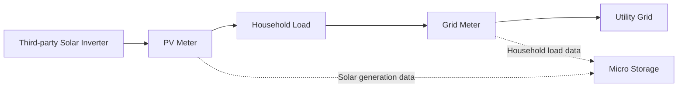

# Dual Metering for Third-Party Inverters

## 1. Why Dual Metering?

When a household already has a third-party solar inverter installed, the system typically relies on a **grid meter** to detect power flow between the home and the utility grid, and to control the energy storage system:

- When surplus energy is exported to the grid, priority is given to charging the battery  
- When household consumption increases, the battery discharges to compensate  
- Grid power consumption is minimized as much as possible  

This approach enables basic control, but the system can only see power exchange between the home and the grid. It cannot directly determine how much solar energy is actually being generated.

For example:

```text
Solar generation: 3000W
├─ Household consumption: 1000W
└─ Excess exported to grid: 2000W
````

In this case, the grid meter can only detect 2000W exported to the grid, but it cannot determine:

* Total solar generation
* How much solar energy is consumed directly by the home
* Where the battery charging energy comes from
* The self-consumption ratio of solar energy

As a result, the system cannot provide complete household energy statistics.

---

## 2. Solution

By adding a **dedicated PV meter** alongside the existing grid meter, the system becomes capable of full energy visibility:

* The grid meter monitors power exchange between the household and the grid
* The PV meter monitors the output of the solar inverter

With both data sources, the system can fully reconstruct household energy flow.

---

## 3. Supported PV Meters

<table>
  <thead>
    <tr>
      <th>Brand</th>
      <th>Device</th>
      <th>Model</th>
    </tr>
  </thead>
  <tbody>
    <tr>
      <td>INDEVOLT</td>
      <td>Meter</td>
      <td>SMD1<br />SMD3</td>
    </tr>
    <tr>
      <td>SOLARMAN</td>
      <td>Meter</td>
      <td>
        MR1-D4-WRE-B<br />
        MR1-D5-W<br />
        MR3-D5-WR<br />
        MR1-D4-WE-B<br />
        MR1-D5-WR<br />
        MR3-D4-WE-B<br />
        MR3-D5-W<br />
        MR3-D4-WRE-B
      </td>
    </tr>
    <tr>
      <td>Shelly</td>
      <td>Meter</td>
      <td>
        Pro 3 EM (400)<br />
        Shelly 3EM<br />
        Shelly Pro EM<br />
        Pro 3 EM - 3CT63
      </td>
    </tr>
  </tbody>
</table>

---

## 4. Connection Overview

The overall system connection is as follows:



### Grid Meter

Typically installed at the household grid connection point or near the distribution panel.

Main functions:

* Monitor total household electricity consumption
* Determine whether the system is importing or exporting electricity
* Provide control signals for battery charge/discharge decisions

### PV Meter

Installed on the AC output side of the third-party solar inverter.

Main functions:

* Measure actual solar generation power
* Report generation data to the system
* Provide foundational data for PV-side energy tracking

---

## 5. App Configuration Steps

After installation, both metering devices must be configured in the app.

| Meter Type  | Data Source |
| ----------- | ----------- |
| Grid Meter  | Grid        |
| PV Meter | Solar       |

1. Open the INDEVOLT App and ensure both meters are added and online.
2. Go to **Profile** > **Data Source**.
3. Tap **Grid** or **Solar**.
4. Select **Custom**.
5. Set the grid meter as the **Grid** data source.
6. Set the PV meter as the **Solar** data source.
7. Save the configuration.


