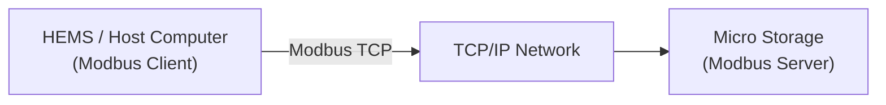
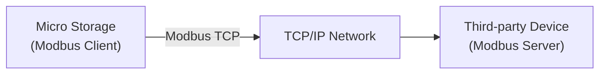

# Modbus Overview

Modbus is a widely used communication protocol in industrial automation and energy management, enabling data exchange between different devices.

Through Modbus, Home Energy Management Systems (HEMS), host computers, or third-party systems can read the operating status of micro energy storages and send control commands when required.

---

## 1. Modbus TCP / RTU

micro energy storages support the following two Modbus communication methods:

- **Modbus TCP**: Transmits Modbus data over Ethernet. After the device is connected to the local network, HEMS or a host computer can access the micro energy storage through its IP address for data reading and control.
- **Modbus RTU**: Transmits Modbus data over an RS485 bus. Devices communicate through RS485 cables, and the master device polls devices to read data. (Not supported yet, coming soon.)

Both methods use the same Modbus protocol and access the same set of device data. The only differences are the communication medium and connection method.

---

## 2. How It Works

Modbus uses a **Client / Server** communication model. The micro energy storage can act as either a Modbus Server or a Modbus Client depending on the application scenario.

### 2.1 Acting as a Modbus Server

When the micro energy storage acts as a Modbus Server, an external system (such as HEMS or a host computer) acts as a Modbus Client to access the device.



1. The client sends read or write requests to the micro energy storage.
2. The request is transmitted to the device through TCP/IP.
3. The micro energy storage reads the corresponding register data or executes control commands.
4. The micro energy storage returns the execution result.
5. The client displays, records, or automatically controls the device based on the data.

### 2.2 Acting as a Modbus Client

When the micro energy storage acts as a Modbus Client, it can connect to a third-party Modbus TCP Server, read device data, and implement energy management and device coordination.



1. The micro energy storage sends read requests to the third-party Modbus Server.
2. The third-party device returns the corresponding register data.
3. The micro energy storage performs energy management and device coordination based on the received data.

---

## 3. Applicable Devices

This feature applies to devices that support Modbus:

| Model                                                                                                                         | Minimum Supported Firmware Version    |
| ----------------------------------------------------------------------------------------------------------------------------- | ------------------------------------- |
| PowerFlex 2000<br />PowerFlex 2000 Eco<br />SolidFlex 2000<br />SolidFlex 2000 Eco                                            | CMS: V140C.0B.0036<br />EMS: V1.01.08 |
| PowerFlex 3000 AC<br />PowerFlex 3000 Hybrid<br />SolidFlex 3000 AC<br />SolidFlex 3000 AC Pro<br />SolidFlex 3000 Hybrid Pro | CMS: V140C.09.3036                    |
| SolidFlex 1200                                                                                                                | CMS: V140B.09.2036                    |

---

## 4. How to Use

### 4.1 Preparation

Before starting, ensure the following:

* ✅ The device supports Modbus.
* ✅ The device is operating normally.
* ✅ The network connection or RS485 wiring has been completed.

:::info
If your device currently only supports Wi-Fi communication, you can replace the communication module with the latest version when a wired network or RS485 communication is required. The new module supports Wi-Fi, Ethernet, and RS485 serial communication.

For the replacement procedure, refer to: [Accessory Replacement](../advanced/accessory-replacement.md)
:::

### 4.2 Enable Modbus

The Modbus function is disabled by default and must be manually enabled in the App.

### 4.3 Configure Communication Parameters

Configure the following parameters in the third-party system or Modbus tool:

**Modbus TCP**

| Parameter | Description                            |
| --------- | -------------------------------------- |
| Device IP | IP address of the micro energy storage |
| TCP Port  | Default: `8899`                        |
| Slave ID  | Device identifier, default: `1`        |

### 4.4 Read Data

After the connection is established, device registers can be read. For register addresses, see [Modbus Register Description](./modbus-register-table.md).

## 5. Recommended Reading Frequency

| Type                         | Limit       |
| ---------------------------- | ----------- |
| Recommended Request Interval | ≥ 5 seconds |
| Minimum Request Interval     | 1 second    |
| Response Time                | 1 second    |

Frequent reading may increase the communication load on the device and affect communication stability.

## 6. Common Function Codes

| Function Code | Description              |
| ------------- | ------------------------ |
| `0x03`        | Read Holding Registers   |
| `0x04`        | Read Input Registers     |
| `0x06`        | Write Single Register    |
| `0x10`        | Write Multiple Registers |

## 7. Python Example

```python
from pymodbus.client import ModbusTcpClient

client = ModbusTcpClient(
    host="190.160.3.167",
    port=8899
)

client.connect()

result = client.read_holding_registers(
    address=0x0478,
    count=1,
    device_id=1
)

print(result.registers)

client.close()
```

---

## 8. FAQ

<details>
  <summary>**Q: Unable to connect to the device**</summary>

Please check:

* Whether Modbus is enabled on the device
* Whether the Client and device are on the same local network (Modbus TCP)
* Whether the RS485 wiring is correct (Modbus RTU)
* Whether the communication parameters are correct

</details>

<details>
  <summary>**Q: Failed to read data**</summary>

Please check:

* Whether the connection is normal
* Whether the function code is correct
* Whether the register address is correct
* Whether the data type matches

</details>
