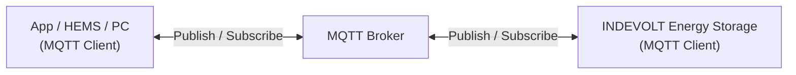

# MQTT Overview

MQTT (Message Queuing Telemetry Transport) is a lightweight messaging protocol based on the Publish/Subscribe model. It is widely used for real-time data exchange between IoT devices.

INDEVOLT energy storage devices support communication with third-party systems through MQTT, which can be used for:

- Real-time monitoring of device status
- Receiving device events and alarms
- Sending device control commands
- Integrating with Home Assistant, EMS, or other energy management platforms

MQTT is especially suitable for scenarios with a large number of devices, limited network bandwidth, or requirements for real-time communication.

---

## 1. How It Works

MQTT uses a publish/subscribe communication model. All clients communicate through an MQTT Broker instead of sending messages directly to each other.

| Component                      | Role        | Description                                                                       |
| ------------------------------ | ----------- | --------------------------------------------------------------------------------- |
| App / HEMS / PC                | MQTT Client | Connects to the Broker, subscribes to device data, or sends control commands      |
| MQTT Broker                    | MQTT Broker | Message server responsible for receiving, filtering, and forwarding MQTT messages |
| INDEVOLT Energy Storage | MQTT Client | Connects to the Broker, uploads device data, and receives control commands        |

Communication process:

1. The energy storage device connects to the MQTT Broker. TLS/SSL encrypted communication can be used according to the Broker configuration.
2. The device actively publishes operating data to the Broker.
3. The App or third-party system subscribes to the corresponding Topics.
4. The MQTT Broker receives published messages and forwards them to all subscribers.
5. Users can publish control commands to the specified Topic.
6. The device receives the command and performs the corresponding operation.

---

## 2. Supported Devices

This feature is available for devices that support MQTT:

| Model                                                                                                                         | Minimum Supported Firmware Version    |
| ----------------------------------------------------------------------------------------------------------------------------- | ------------------------------------- |
| PowerFlex 2000 PowerFlex 2000 Eco SolidFlex 2000 SolidFlex 2000 Eco                                            | CMS: V140C.0B.0036 EMS: V1.01.08 |
| PowerFlex 3000 AC PowerFlex 3000 Hybrid SolidFlex 3000 AC SolidFlex 3000 AC Pro SolidFlex 3000 Hybrid Pro | CMS: V140C.09.3036                    |
| SolidFlex 1200                                                                                                                | CMS: V140B.09.2036                    |

---

## 3. Getting Started

### 3.1 Prerequisites

Before using MQTT, ensure that:

* ✅ The device is powered on properly
* ✅ The device is connected to the network
* ✅ The device supports MQTT functionality

### 3.2 Enable MQTT

MQTT is disabled by default. Enable MQTT manually in the App and configure the MQTT Broker information.

---

### 3.3 MQTT Connection Parameters

| Parameter      | Description                                                                           |
| -------------- | ------------------------------------------------------------------------------------- |
| Broker Address | MQTT Broker address, which can be a local server IP address or a cloud server address |
| Port           | 1883 (non-encrypted) / 8883 (TLS/SSL encrypted)                                       |
| Client ID      | Uses the device serial number (SN) by default                                         |
| Username       | MQTT login username, empty by default and supports customization                      |
| Password       | MQTT login password, empty by default and supports customization                      |
| TLS            | Whether to enable TLS encryption                                                      |
| CA Certificate | CA certificate used in TLS mode (if required)                                         |
| Keep Alive     | 60 seconds by default                                                                 |

---

## 4. Topic

A Topic is used to identify the category and routing path of MQTT messages. It is similar to a file system path (for example: `energy/device1/soc`). The MQTT Broker forwards messages to corresponding subscribers based on the Topic.

MQTT supports subscribing to a single Topic or using **wildcards** for batch subscriptions.

| Wildcard | Description            | Example      |
| -------- | ---------------------- | -------------- |
| `+`      | Matches a single level | `energy/+/soc` Matches `energy/device1/soc` and `energy/device2/soc`. It does not match `energy/group/device1/soc` because it contains an additional level. |
| `#`      | Matches all levels     | `energy/#` Subscribes to all Topics under `energy`, including `energy/device1/soc`, `energy/device1/power`, and `energy/device2/status`.                         |

For the complete Topic definition, refer to: [MQTT Topic](./mqtt-topic.md)

---

## 5. QoS

QoS (Quality of Service) indicates the reliability level of MQTT message delivery.

| QoS   | Description                                                                  |
| ----- | ---------------------------------------------------------------------------- |
| QoS 0 | Delivered at most once. Fastest transmission, but delivery is not guaranteed |
| QoS 1 | Delivered at least once. Messages may be duplicated                          |
| QoS 2 | Delivered exactly once. Highest reliability                                  |

Recommended usage:

* Real-time status data: QoS 0 or QoS 1
* Control commands: QoS 1

---

## 6. FAQ

  
**Q: MQTT cannot connect**

Check the following:

* Whether the Broker address is correct
* Whether the username and password are correct
* Whether the network connection is normal
* Whether TLS encryption is enabled

  
**Q: Why do I receive no data after subscribing?**

Check the following:

* Whether the Topic is correct
* Whether the Topic case matches exactly
* Whether the correct Topic level is subscribed
* Whether the device is online

