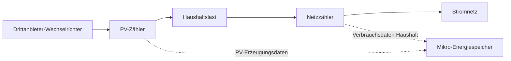

# Dual-Messkonzept für Drittanbieter-Wechselrichter

## 1. Warum ein Dual-Messsystem?

Wenn in einem Haushalt bereits ein Wechselrichter eines Drittanbieters installiert ist, erfasst das System in der Regel über den **Netzzähler** den Energiefluss zwischen Haushalt und Stromnetz und steuert darauf basierend den Energiespeicher:

- Bei Einspeisung von Überschussenergie wird bevorzugt der Akku geladen  
- Bei erhöhtem Verbrauch wird Energie aus dem Akku bereitgestellt  
- Der Netzbezug soll möglichst reduziert werden  

Diese Methode ermöglicht eine grundlegende Steuerung. Allerdings sieht das System nur den Energieaustausch mit dem Stromnetz und kennt die tatsächliche PV-Erzeugung nicht.

Beispiel:

```text
PV-Erzeugung 3000 W
├─ Haushaltsverbrauch 1000 W
└─ Überschuss 2000 W Einspeisung ins Netz
````

Der Netzzähler kann in diesem Fall nur erkennen, dass 2000 W ins Netz eingespeist werden. Er kann jedoch nicht bestimmen:

* Wie viel Energie die PV-Anlage insgesamt erzeugt
* Wie viel PV-Energie direkt im Haushalt verbraucht wird
* Aus welcher Quelle der Akku geladen wird
* Wie hoch der Eigenverbrauchsanteil der PV-Anlage ist

Damit fehlen dem System wichtige Informationen für eine vollständige Energiebilanz.

---

## 2. Lösung

Durch die Ergänzung eines **PV-Zählers** zusätzlich zum vorhandenen Netzzähler wird das System erweitert:

* Der Netzzähler erfasst den Energieaustausch zwischen Haushalt und Stromnetz
* Der PV-Zähler erfasst die Erzeugungsdaten des Wechselrichters

Durch die Kombination beider Datenquellen kann das System den Energiefluss im Haushalt vollständig berechnen und darstellen.

---

## 3. Unterstützte PV-Zähler

<table>
  <thead>
    <tr>
      <th>Marke</th>
      <th>Gerät</th>
      <th>Modell</th>
    </tr>
  </thead>
  <tbody>
    <tr>
      <td>INDEVOLT</td>
      <td>Zähler</td>
      <td>SMD1<br />SMD3</td>
    </tr>
    <tr>
      <td>SOLARMAN</td>
      <td>Zähler</td>
      <td>
        MR1-D4-WRE-B<br />
        MR1-D5-W<br />
        MR3-D5-WR<br />
        MR1-D4-WE-B<br />
        MR1-D5-WR<br />
        MR3-D4-WE-B<br />
        MR3-D5-W<br />
        MR3-D4-WRE-B
      </td>
    </tr>
    <tr>
      <td>Shelly</td>
      <td>Zähler</td>
      <td>
        Pro 3 EM (400)<br />
        Shelly 3EM<br />
        Shelly Pro EM<br />
        Pro 3 EM - 3CT63
      </td>
    </tr>
  </tbody>
</table>

---

## 4. Anschlussübersicht

Das Gesamtsystem ist wie folgt aufgebaut:



### Netzzähler

Typischerweise am Netzanschlusspunkt oder im Zählerschrank installiert.

Hauptfunktionen:

* Überwachung des gesamten Haushaltsverbrauchs
* Erkennung von Netzbezug oder Einspeisung
* Grundlage für Lade- und Entladeentscheidungen des Speichers

### PV-Zähler

Wird auf der AC-Ausgangsseite des Drittanbieter-Wechselrichters installiert.

Hauptfunktionen:

* Erfassung der tatsächlichen PV-Erzeugungsleistung
* Übermittlung der Erzeugungsdaten an das System
* Bereitstellung grundlegender Daten zur Stromerzeugung

---

## 5. App-Konfiguration

Nach der Installation müssen die beiden Zähler entsprechend ihrer Datenquelle konfiguriert werden.

| Messgerät  | Datenquelle |
| ---------- | ----------- |
| Netzzähler | Stromnetz   |
| PV-Zähler  | Solar          |

1. Öffnen Sie die INDEVOLT App und stellen Sie sicher, dass beide Zähler hinzugefügt und online sind.
2. Gehen Sie zu **Profil** > **Datenquelle**.
3. Tippen Sie auf **Stromnetz** oder **Solar**.
4. Wählen Sie **Benutzerdefiniert**.
5. Setzen Sie den Netzzähler als Datenquelle für das **Stromnetz**.
6. Setzen Sie den PV-Zähler als Datenquelle für **Solar**.
7. Speichern Sie die Einstellungen.


