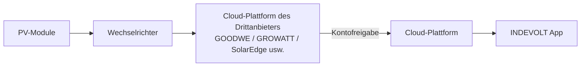

# Integration von Drittanbieter-Wechselrichtern

Wenn in Ihrem Haushalt bereits ein Photovoltaik-Wechselrichter eines anderen Herstellers installiert ist, kann dieser über die folgenden Methoden in die Cloud-Plattform eingebunden werden, um:

- die aktuelle PV-Erzeugung in Echtzeit zu überwachen  
- den Energieverbrauch und die Einspeisung zu analysieren  
- Strategien für Laden und Entladen des Energiespeichers zu optimieren  

Aktuell werden zwei Integrationsmethoden unterstützt:

1. [Cloud-zu-Cloud-Verbindung](#methode-1-cloud-zu-cloud-verbindung)
2. [Erfassung der Erzeugungsdaten über intelligente Steckdose oder Energiezähler](#methode-2-erfassung-über-steckdose-oder-energiezähler)

---

## Methode 1: Cloud-zu-Cloud-Verbindung

### Anwendungsbereich

Derzeit werden folgende Marken unterstützt:

* GOODWE
* GROWATT
* FusionSolar
* SolarEdge
* SolaX
* Solplanet

Weitere Marken werden schrittweise unterstützt.

### Funktionsprinzip

Durch die Verknüpfung des Kontos der Drittanbieter-Plattform kann die App direkt auf die Wechselrichterdaten dieses Kontos zugreifen.

### Konfigurationsschritte

1. Öffnen Sie die INDEVOLT App und gehen Sie zu **Profil**.
2. Tippen Sie auf **Energie-Integrationen**.
3. Wählen Sie die entsprechende Wechselrichter-Marke aus.
4. Melden Sie sich gemäß Anleitung bei der Drittanbieter-Plattform an und erteilen Sie die Berechtigung.
5. Nach erfolgreicher Autorisierung synchronisiert das System automatisch die Geräte dieses Kontos und fügt sie dem Haushalt hinzu.

👉 Detaillierte Anweisungen zur Autorisierung: [Energieanbieter verbinden](https://docs.indevolt.com/de/docs/category/brand-connection)

---

## Methode 2: Erfassung über Steckdose oder Energiezähler

**Intelligente Steckdose**

**Energiezähler**

### Funktionsprinzip

Die Ausgangsleistung des Wechselrichters wird über eine intelligente Steckdose oder einen Energiezähler gemessen und als PV-Erzeugungsdaten für die Energieanalyse verwendet.

### Konfigurationsschritte

#### Schritt 1: Messgerät installieren

Wählen Sie je nach Situation eine der folgenden Optionen:

<u>Option A: Intelligente Steckdose</u>

* AC-Ausgang des Wechselrichters an die Steckdose anschließen

<u>Option B: Energiezähler + CT</u>

* Energiezähler in das Hausnetz integrieren zur Spannungsmessung
* CT an die AC-Ausgangsleitung des Wechselrichters klemmen, zur Messung von Stromrichtung und -stärke

#### Schritt 2: Gerät hinzufügen

Fügen Sie in der INDEVOLT App die intelligente Steckdose oder den Energiezähler hinzu und stellen Sie sicher, dass das Gerät online ist.

#### Schritt 3: Datenquelle konfigurieren

1. Öffnen Sie die App.
2. Gehen Sie zu **Profil > Datenquelle**.
3. Wählen Sie unter **Solar** die Option **Benutzerdefiniert**.
4. Wählen Sie die Steckdose oder den Energiezähler für die Energiebilanz aus.
5. Speichern Sie die Einstellungen.

Nach Abschluss der Konfiguration werden die vom ausgewählten Gerät erfassten Leistungsdaten automatisch als PV-Erzeugungsdaten erkannt und für die Analyse der Energieflüsse im Haushalt, die Ertragsstatistik sowie die Anzeige im Energie-Dashboard verwendet.

:::warning
* Stellen Sie sicher, dass das Messgerät im Ausgangskreis des Wechselrichters installiert ist.
* Eine falsche Einbaurichtung des CT kann zu negativen oder fehlerhaften Leistungswerten führen.
* Diese Methode basiert auf einer indirekten Messung. Die tatsächlichen Messwerte können daher geringfügig von den am Wechselrichter angezeigten Werten abweichen.
:::