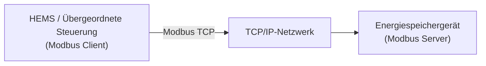
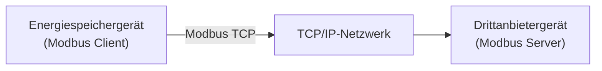

# Modbus-Übersicht

Modbus ist ein weit verbreitetes Kommunikationsprotokoll im Bereich der industriellen Automatisierung und des Energiemanagements. Es ermöglicht den Datenaustausch zwischen verschiedenen Geräten.

Über Modbus können Home Energy Management Systeme (HEMS), übergeordnete Steuerungen oder Drittanbietersysteme den Betriebsstatus des Energiespeichers auslesen und bei Bedarf Steuerbefehle senden.

---

## 1. Modbus TCP / RTU

Das Energiespeichersystem unterstützt die folgenden zwei Modbus-Kommunikationsarten:

- **Modbus TCP**: Überträgt Modbus-Daten über Ethernet. Nachdem das Gerät mit dem lokalen Netzwerk verbunden wurde, können HEMS oder übergeordnete Systeme über die IP-Adresse des Geräts auf das Energiespeichersystem zugreifen, um Daten auszulesen und Steuerungen durchzuführen.
- **Modbus RTU**: Überträgt Modbus-Daten über einen RS485-Bus. Geräte werden über RS485-Kommunikationsleitungen verbunden und der Master liest Daten durch zyklisches Abfragen aus. (Derzeit nicht unterstützt, bitte warten.)

Beide Varianten verwenden dasselbe Modbus-Protokoll und greifen auf dieselben Gerätedaten zu. Der Unterschied liegt lediglich im Kommunikationsmedium und der Verbindungsart.

---

## 2. Funktionsweise

Modbus verwendet ein **Client-/Server-Kommunikationsmodell**. Das Energiespeichersystem kann je nach Anwendung entweder als Modbus Server oder Modbus Client verwendet werden.

### 2.1 Verwendung als Modbus Server

Wenn das Energiespeichersystem als Modbus Server arbeitet, greift ein externes System (z. B. HEMS oder eine übergeordnete Steuerung) als Modbus Client auf das Gerät zu.



1. Der Client sendet Lese- oder Schreibanforderungen an das Energiespeichersystem.
2. Die Anfrage wird über TCP/IP an das Gerät übertragen.
3. Das Energiespeichersystem liest die entsprechenden Registerdaten oder führt Steuerbefehle aus.
4. Das Energiespeichersystem sendet das Ausführungsergebnis zurück.
5. Der Client zeigt die Daten an, speichert sie oder verwendet sie für eine automatische Steuerung.

### 2.2 Verwendung als Modbus Client

Wenn das Energiespeichersystem als Modbus Client arbeitet, kann es eine Verbindung zu einem Drittanbieter-Modbus-TCP-Server herstellen, Gerätedaten auslesen und eine Energieverwaltung sowie Geräteverknüpfung realisieren.



1. Das Energiespeichersystem sendet eine Leseanforderung an den Drittanbieter-Modbus-Server.
2. Das Drittanbietergerät gibt die entsprechenden Registerdaten zurück.
3. Das Energiespeichersystem führt anhand der erhaltenen Daten Energieverwaltung und Geräteverknüpfungen durch.

---

## 3. Unterstützte Geräte

Diese Funktion gilt für Geräte mit Modbus-Unterstützung:

| Modell                                                                                                                        | Mindest unterstützte Firmware-Version |
| ----------------------------------------------------------------------------------------------------------------------------- | ------------------------------------- |
| PowerFlex 2000<br />PowerFlex 2000 Eco<br />SolidFlex 2000<br />SolidFlex 2000 Eco                                            | CMS: V140C.0B.0036<br />EMS: V1.01.08 |
| PowerFlex 3000 AC<br />PowerFlex 3000 Hybrid<br />SolidFlex 3000 AC<br />SolidFlex 3000 AC Pro<br />SolidFlex 3000 Hybrid Pro | CMS: V140C.09.3036                    |
| SolidFlex 1200                                                                                                                | CMS: V140B.09.2036                    |

---

## 4. Verwendung

### 4.1 Vorbereitung

Stellen Sie vor der Verwendung sicher, dass:

* ✅ Das Gerät die Modbus-Funktion unterstützt.
* ✅ Das Gerät ordnungsgemäß in Betrieb ist.
* ✅ Die Netzwerk- oder RS485-Verkabelung abgeschlossen ist.

:::info
Wenn das Gerät aktuell nur WLAN-Kommunikation unterstützt, kann das Kommunikationsmodul durch eine neue Version ersetzt werden, wenn eine kabelgebundene Netzwerkverbindung oder RS485-Kommunikation erforderlich ist. Das neue Modul unterstützt WLAN, Ethernet und die RS485-Schnittstelle.

Eine detaillierte Anleitung zum Austausch finden Sie unter: [Zubehör austauschen](../advanced/accessory-replacement.md)
:::

### 4.2 Modbus aktivieren

Die Modbus-Funktion ist standardmäßig deaktiviert und muss in der App manuell aktiviert werden.


### 4.3 Kommunikationsparameter konfigurieren

Konfigurieren Sie die folgenden Parameter im Drittanbietersystem oder Modbus-Tool:

**Modbus TCP**

| Parameter | Beschreibung                    |
| --------- | ------------------------------- |
| Geräte-IP | IP-Adresse des Energiespeichers |
| TCP-Port  | Standardmäßig `8899`            |
| Slave ID  | Gerätekennung, Standardwert `1` |

### 4.4 Daten auslesen

Nach erfolgreicher Verbindung können die Geräteregister ausgelesen werden.

Die Registeradressen finden Sie unter [Modbus-Registerbeschreibung](./modbus-register-table.md).

---

## 5. Empfohlene Abfragefrequenz

| Typ                             | Begrenzung   |
| ------------------------------- | ------------ |
| Empfohlenes Anfrageintervall    | ≥ 5 Sekunden |
| Minimal unterstütztes Intervall | 1 Sekunde    |
| Antwortzeit                     | 1 Sekunde    |

Häufige Abfragen können die Kommunikationslast des Geräts erhöhen und die Stabilität der Verbindung beeinträchtigen.

---

## 6. Häufig verwendete Funktionscodes

| Funktionscode | Beschreibung                                          |
| ------------- | ----------------------------------------------------- |
| `0x03`        | Holding Register lesen (Read Holding Registers)       |
| `0x04`        | Input Register lesen (Read Input Registers)           |
| `0x06`        | Einzelnes Register schreiben (Write Single Register)  |
| `0x10`        | Mehrere Register schreiben (Write Multiple Registers) |

---

## 7. Python-Beispiel

```python
from pymodbus.client import ModbusTcpClient

client = ModbusTcpClient(
    host="190.160.3.167",
    port=8899
)

client.connect()

result = client.read_holding_registers(
    address=0x0478,
    count=1,
    device_id=1
)

print(result.registers)

client.close()
```

---

## 8. FAQ

<details>
  <summary>**Q: Das Gerät kann nicht verbunden werden.**</summary>

Bitte prüfen Sie:

* Ob Modbus auf dem Gerät aktiviert wurde.
* Ob sich Client und Gerät im selben lokalen Netzwerk befinden (Modbus TCP).
* Ob die RS485-Verkabelung korrekt ist (Modbus RTU).
* Ob die Kommunikationsparameter korrekt eingestellt sind.

</details>

<details>
  <summary>**Q: Das Auslesen von Daten schlägt fehl.**</summary>

Bitte prüfen Sie:

* Ob die Verbindung ordnungsgemäß funktioniert.
* Ob der Funktionscode korrekt ist.
* Ob die Registeradresse korrekt ist.
* Ob der Datentyp übereinstimmt.

</details>
