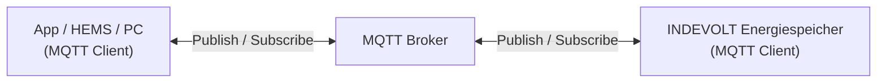

# MQTT-Übersicht

MQTT (**Message Queuing Telemetry Transport**) ist ein leichtgewichtiges Nachrichtenprotokoll, das auf dem **Publish/Subscribe-Modell** basiert und häufig für den Echtzeit-Datenaustausch zwischen IoT-Geräten eingesetzt wird.

INDEVOLT-Energiespeicher unterstützen die Kommunikation mit Drittanbietersystemen über MQTT. Dies ermöglicht:

- Echtzeitabruf des Gerätestatus
- Empfang von Geräteereignissen und Alarmmeldungen
- Senden von Steuerbefehlen an Geräte
- Integration mit Home Assistant, EMS oder anderen Energiemanagementplattformen

MQTT eignet sich besonders für Szenarien mit vielen Geräten, begrenzter Netzwerkbandbreite oder Anforderungen an eine Echtzeitkommunikation.

---

## 1. Funktionsweise

MQTT verwendet ein Publish/Subscribe-Kommunikationsmodell. Alle Clients kommunizieren über einen MQTT Broker und senden Nachrichten nicht direkt untereinander.

| Komponente               | Rolle       | Beschreibung                                                                    |
| ------------------------ | ----------- | ------------------------------------------------------------------------------- |
| App / HEMS / PC          | MQTT Client | Verbindet sich mit dem Broker, abonniert Gerätedaten oder sendet Steuerbefehle  |
| MQTT Broker              | MQTT Broker | Nachrichtenserver, der MQTT-Nachrichten empfängt, filtert und weiterleitet      |
| INDEVOLT Energiespeicher | MQTT Client | Verbindet sich mit dem Broker, überträgt Gerätedaten und empfängt Steuerbefehle |

1. Der Energiespeicher verbindet sich mit dem MQTT Broker. Je nach Broker-Konfiguration kann die Kommunikation über TLS/SSL verschlüsselt werden.
2. Das Gerät veröffentlicht aktiv Betriebsdaten am Broker.
3. Die App oder ein Drittanbietersystem abonniert die entsprechenden Topics.
4. Der MQTT Broker empfängt veröffentlichte Nachrichten und leitet sie an alle Abonnenten weiter.
5. Der Benutzer kann Steuerbefehle an bestimmte Topics senden.
6. Das Gerät empfängt die Befehle und führt die entsprechenden Aktionen aus.

---

## 2. Unterstützte Geräte

Diese Funktion gilt für Geräte mit MQTT-Unterstützung:

| Modell                                                                                                                        | Mindest unterstützte Firmware-Version |
| ----------------------------------------------------------------------------------------------------------------------------- | ------------------------------------- |
| PowerFlex 2000 PowerFlex 2000 Eco SolidFlex 2000 SolidFlex 2000 Eco                                            | CMS: V140C.0B.0036 EMS: V1.01.08 |
| PowerFlex 3000 AC PowerFlex 3000 Hybrid SolidFlex 3000 AC SolidFlex 3000 AC Pro SolidFlex 3000 Hybrid Pro | CMS: V140C.09.3036                    |
| SolidFlex 1200                                                                                                                | CMS: V140B.09.2036                    |

---

## 3. Verwendung

### 3.1 Voraussetzungen

Stellen Sie vor der Verwendung von MQTT sicher, dass:

* ✅ Das Gerät ordnungsgemäß mit Strom versorgt wird.
* ✅ Das Gerät erfolgreich mit dem Netzwerk verbunden ist.
* ✅ Das Gerät die MQTT-Funktion unterstützt.

### 3.2 MQTT aktivieren

Die MQTT-Funktion ist standardmäßig deaktiviert und muss in der App manuell aktiviert werden. Anschließend müssen die MQTT Broker-Informationen konfiguriert werden.

### 3.3 MQTT-Verbindungsparameter

| Parameter      | Beschreibung                                                               |
| -------------- | -------------------------------------------------------------------------- |
| Broker-Adresse | Adresse des MQTT Brokers, z. B. lokale Server-IP oder Cloud-Server-Adresse |
| Port           | 1883 (unverschlüsselt) / 8883 (TLS/SSL-verschlüsselt)                      |
| Client ID      | Standardmäßig die Seriennummer (SN) des Geräts                             |
| Benutzername   | MQTT-Anmeldekonto, standardmäßig leer, kann angepasst werden               |
| Passwort       | MQTT-Anmeldepasswort, standardmäßig leer, kann angepasst werden            |
| TLS            | Gibt an, ob TLS-Verschlüsselung aktiviert ist                              |
| CA Certificate | CA-Zertifikat für den TLS-Modus (falls erforderlich)                       |
| Keep Alive     | Standardmäßig 60 Sekunden                                                  |

---

## 4. Topic

Ein **Topic** dient zur Kennzeichnung der Kategorie und des Routings von MQTT-Nachrichten und ist vergleichbar mit einem Pfad in einem Dateisystem (z. B. `energy/device1/soc`). Der MQTT Broker leitet Nachrichten anhand des Topics an die entsprechenden Abonnenten weiter.

MQTT unterstützt sowohl das Abonnieren einzelner Topics als auch die Verwendung von **Wildcards** für Sammelabonnements.

| Wildcard | Funktion                         | Beispiel                                                                                                                                                                             |
| -------- | -------------------------------- | ------------------------------------------------------------------------------------------------------------------------------------------------------------------------------------ |
| `+`      | Entspricht einer einzelnen Ebene | `energy/+/soc` Passt zu `energy/device1/soc` und `energy/device2/soc`. Passt jedoch nicht zu `energy/group/device1/soc`, da diese Struktur eine zusätzliche Ebene enthält. |
| `#`      | Entspricht allen Ebenen          | `energy/#` Abonniert alle Topics unter `energy`, einschließlich: `energy/device1/soc`, `energy/device1/power`, `energy/device2/status`                                     |

Eine vollständige Definition der Topics finden Sie unter: [MQTT Topic](./mqtt-topic.md)

---

## 5. QoS

QoS (**Quality of Service**) beschreibt die Zuverlässigkeitsstufe der Nachrichtenübertragung.

| QoS   | Beschreibung                                                                 |
| ----- | ---------------------------------------------------------------------------- |
| QoS 0 | Höchstens einmal gesendet, schnellste Übertragung, aber ohne Zustellgarantie |
| QoS 1 | Mindestens einmal gesendet, Nachrichten können doppelt empfangen werden      |
| QoS 2 | Genau einmal zugestellt, höchste Zuverlässigkeit                             |

Empfehlungen:

* Echtzeit-Statusdaten: QoS 0 oder 1
* Steuerbefehle: QoS 1

---

## 6. FAQ

  
**Q: MQTT kann keine Verbindung herstellen.**

Bitte prüfen Sie:

* Ob die Broker-Adresse korrekt ist.
* Ob Benutzername und Passwort korrekt sind.
* Ob die Netzwerkverbindung funktioniert.
* Ob die TLS-Verschlüsselung aktiviert wurde.

  
**Q: Warum werden nach dem Abonnieren keine Daten empfangen?**

Bitte prüfen Sie:

* Ob das Topic korrekt ist.
* Ob die Groß-/Kleinschreibung des Topics übereinstimmt.
* Ob die falsche Topic-Ebene abonniert wurde.
* Ob das Gerät online ist.

