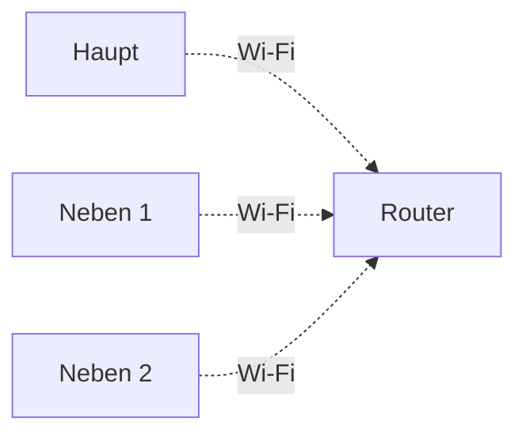
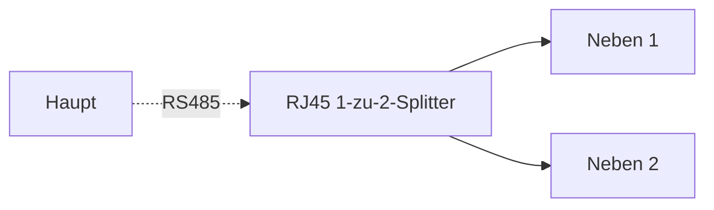

# Cluster

## 1. Was ist ein Cluster

Cluster-Betrieb bezeichnet die Verbindung mehrerer Mikrospeicher zu einem gemeinsam gesteuerten System, in dem mehrere Geräte gemeinsam die Stromversorgung, Energiespeicherung und das Energiemanagement übernehmen.

In einem Cluster-Betrieb wird ein Gerät als **Hauptgerät** festgelegt, das für die Steuerung und Koordination des Gesamtsystems verantwortlich ist. Die übrigen Geräte fungieren als **Nebengeräte** und werden in das System eingebunden. Die Geräte kommunizieren automatisch miteinander und arbeiten synchron.

Durch den Cluster-Betrieb erhöhen sich sowohl die Gesamtleistung als auch die gesamte Speicherkapazität des Systems. Dies eignet sich besonders für hohe Lasten, lange Notstromversorgung oder spätere Systemerweiterungen.

---

## 2. Vorteile eines Clusters

Die Leistung und Kapazität eines einzelnen Geräts sind begrenzt. Wenn der Haushaltsverbrauch hoch ist oder eine längere Versorgungszeit benötigt wird, kann das System durch Cluster-Betrieb erweitert werden.

**Erhöhung der Ausgangsleistung**

Mehrere Geräte können gleichzeitig Leistung bereitstellen und dadurch größere Lasten versorgen.

> Beispiel:
> - 1 × SolidFlex 2000: maximale Wechselrichterleistung ca. 2400 W  
> - 2 Geräte im Cluster: ca. 4800 W  
> - Die tatsächliche Leistung ist weiterhin durch Netzbegrenzungen, Verkabelung und lokale Vorschriften eingeschränkt.

**Erhöhung der Speicherkapazität**

Im Cluster teilen sich mehrere Batteriepacks die Energiespeicherung, wodurch die Versorgungsdauer deutlich verlängert wird.

> Beispiel:
> - 1 × SolidFlex 2000 + 5 × SFA1800: ca. 10,8 kWh  
> - Zwei Systeme im Cluster: ca. 21,6 kWh  

**Flexible Erweiterung**

Das System unterstützt schrittweise Erweiterung. Nutzer können zunächst ein Gerät installieren und später weitere Geräte hinzufügen, ohne das Gesamtsystem neu aufzubauen.

---

## 3. Unterstützte Geräte

Die folgenden Modelle werden als Haupt- oder Nebengerät unterstützt:

<table><thead>
  <tr>
    <th></th>
    <th colspan="2">Zentralisiert</th>
    <th colspan="2">Koordiniert</th>
  </tr></thead>
<tbody>
  <tr>
    <td>Modell</td>
    <td>Haupt</td>
    <td>Neben</td>
    <td>Haupt</td>
    <td>Neben</td>
  </tr>
  <tr>
    <td>BK1600</td>
    <td>❌</td>
    <td>✅</td>
    <td>✅</td>
    <td>✅</td>
  </tr>
  <tr>
    <td>BK1600 Ultra</td>
    <td>✅</td>
    <td>✅</td>
    <td>✅</td>
    <td>✅</td>
  </tr>
  <tr>
    <td>SolidFlex 2000 PowerFlex 2000 SolidFlex 2000 Eco PowerFlex 2000 Eco</td>
    <td>✅</td>
    <td>✅</td>
    <td>✅</td>
    <td>✅</td>
  </tr>
  <tr>
    <td>SolidFlex 1200</td>
    <td>✅</td>
    <td>✅</td>
    <td>✅</td>
    <td>✅</td>
  </tr>
  <tr>
    <td>SolidFlex 3000 AC SolidFlex 3000 AC Pro SolidFlex 3000 Hybrid Pro PowerFlex 3000 AC PowerFlex 3000 Hybrid</td>
    <td>✅</td>
    <td>✅</td>
    <td>✅</td>
    <td>✅</td>
  </tr>
</tbody>
</table>

:::info

- Die Cluster-Funktion zwischen SolidFlex / PowerFlex Modellen und der BK-Serie wurde nicht vollständig validiert und wird daher nicht empfohlen. SolidFlex- und PowerFlex-Modelle können jedoch miteinander zu einem Cluster verbunden werden.
- Im Cluster-Betrieb:
  - Der Anschluss von PV-Modulen über den **PV-Anschluss** wird unterstützt.
  - Die Funktion zum Anschluss von Mikro-Wechselrichtern und Lasten über den **Backup-Anschluss** befindet sich noch in der Optimierung und wird derzeit nicht vollständig unterstützt.

:::

---

## 4. Cluster-Modus

Das System unterstützt maximal **3 Geräte in einem Cluster**:

- 1 Hauptgerät
- Bis zu 2 Nebengeräte

Je nach Installationsumgebung können die folgenden zwei Cluster-Modi ausgewählt werden:

### 4.1 Koordinierter Cluster

Jedes Gerät ist separat mit dem Stromnetz verbunden und übernimmt eigene AC-Ein- und Ausgänge. Die Geräte synchronisieren ihre Daten über das Kommunikationsnetz, während das Hauptgerät die Leistungsverteilung und den Betrieb koordiniert.

import Tabs from '@theme/Tabs';
import TabItem from '@theme/TabItem';

<Tabs>
  <TabItem value="gen1" label="SolidFlex / PowerFlex" default>
    
  </TabItem>
  <TabItem value="gen2" label="BK1600 / BK1600 Ultra">
    
  </TabItem>
</Tabs>

### 4.2 Zentralisierter Cluster

Die Nebengeräte werden nacheinander über die Stromleitungen mit dem Hauptgerät verbunden. Alle AC-Ein- und Ausgänge werden im Hauptgerät zusammengeführt, das anschließend die gesamte Netzschnittstelle sowie die Leistungssteuerung übernimmt.

Verkabelung:
- Das Hauptgerät wird über **GRID IN/OUT** mit dem Stromnetz verbunden  
- Der **Backup-Port** des Hauptgeräts wird mit dem **GRID IN/OUT** des ersten Nebengeräts verbunden  
- Weitere Nebengeräte werden kaskadiert verbunden: **Backup → GRID IN/OUT**

<Tabs>
  <TabItem value="gen1" label="SolidFlex / PowerFlex" default>
    
  </TabItem>
  <TabItem value="gen2" label="BK1600 / BK1600 Ultra">
    
  </TabItem>
</Tabs>

---

## 5. Cluster-Kommunikation

Die Geräte müssen miteinander kommunizieren, um den Betriebsstatus zu synchronisieren. Es werden die folgenden zwei Kommunikationsmethoden unterstützt:

### 5.1 Wi-Fi-Kommunikation

Verbinden Sie alle Geräte mit demselben Wi-Fi-Netzwerk. Diese Methode eignet sich für Installationen, bei denen sich die Geräte nahe beieinander befinden und ein stabiles Wi-Fi-Netzwerk verfügbar ist.

### 5.2 RS485-Kommunikation

Verbinden Sie Haupt- und Nebengeräte über die RS485-Anschlüsse mit einem Netzwerkkabel. Diese Methode eignet sich für Umgebungen mit schwacher Netzwerkverbindung oder für Anwendungen, die eine stabile kabelgebundene Kommunikation erfordern.

Wenn zwei Nebengeräte angeschlossen werden sollen, kann ein **RJ45 1-zu-2-Splitter** verwendet werden, um das Hauptgerät mit den Nebengeräten zu verbinden.

**RJ45-Pinbelegung**

| Pin | Signal | Funktion |
| --- | --- | --- |
| 1 | GND | Schirmmasse |
| 2 | GND | Schirmmasse |
| 3 | N.C. | Nicht verbunden |
| 4 | RS485 A | Differenzielles RS485-Signal A (für INDEVOLT Smart CT) |
| 5 | RS485 B | Differenzielles RS485-Signal B (für INDEVOLT Smart CT) |
| 6 | N.C. | Nicht verbunden |
| 7 | DC 5V | 5-V-Stromversorgung, maximaler Strom: 200 mA |
| 8 | DC 5V | 5-V-Stromversorgung, maximaler Strom: 200 mA |

:::info
Wenn das Gerät derzeit nur Wi-Fi unterstützt und eine RS485-Cluster-Verbindung erforderlich ist, kann das Kommunikationsmodul durch eine neuere Version ersetzt werden. Weitere Informationen finden Sie unter: [Zubehör austauschen](../advanced/accessory-replacement.md)
:::

---

## 6. Leistungsbegrenzungen des Clusters

Nach der Einrichtung eines Clusters hängt die maximale Systemleistung ab von:

* Cluster-Modus
* Gerätemodell

Dabei gilt:

* Die **AC-Eingangsleistung** bestimmt die maximale Leistung, die das System aus dem Stromnetz beziehen kann.
* Die **AC-Ausgangsleistung** bestimmt die maximale Leistung, die das System an Verbraucher liefern kann.

:::danger
Stellen Sie sicher, dass die maximale Ausgangsleistung des Systems den lokalen elektrischen Normen und Sicherheitsvorschriften entspricht.
:::

### 6.1 Leistung eines einzelnen Geräts

Die maximale AC-Eingangs-/Ausgangsleistung der einzelnen Gerätemodelle ist wie folgt:

| Modell     | Maximale AC-Ausgangs-/Eingangsleistung |
| ---------- | -------------------------------------- |
| BK-Serie   | 1200 W                                 |
| 2000-Serie | 2400 W                                 |
| 1200-Serie | 1200 W                                 |
| 3000-Serie | 3000 W                                 |

### 6.2 Maximale AC-Eingangsleistung

Nach der Cluster-Einrichtung können mehrere Geräte gleichzeitig AC-Energie aufnehmen.

Maximale AC-Eingangsleistung des Clusters = Summe der maximalen AC-Eingangsleistung aller Cluster-Geräte

### 6.3 Maximale AC-Ausgangsleistung

Die maximale AC-Ausgangsleistung eines Clusters hängt vom Cluster-Modus ab.

* **Koordinierter Cluster:**
  Maximale AC-Ausgangsleistung des Clusters = Summe der maximalen AC-Ausgangsleistung aller Cluster-Geräte

* **Zentralisierter Cluster:**
  Der AC-Eingang und AC-Ausgang aller Geräte werden letztendlich über das Hauptgerät mit dem Stromnetz verbunden. Daher ist die AC-Ausgangsleistung durch die Leistungsfähigkeit des Hauptgeräts begrenzt.

  | Haupt-Modell | Maximale AC-Ausgangsleistung des Clusters |
  | ------------- | ----------------------------------------- |
  | BK1600 Ultra  | 2300 W                                    |
  | 2000-Serie    | 3600 W                                    |
  | 1200-Serie    | 2300 W                                    |
  | 3000-Serie    | 3600 W                                    |

:::note
Im Cluster-Betrieb kann der Anschluss von Mikro-Wechselrichtern und Lasten über den Bypass-Anschluss zu einer ungenauen Leistungsanzeige führen. Diese Funktion wird derzeit weiter optimiert.
:::

---

## 7. Leistungsverteilung im Cluster

Während des Cluster-Betriebs verteilt das System die Leistung automatisch entsprechend dem Ladezustand (SOC) der Geräte und den Lastbedingungen. Daher:

* Die Ausgangsleistung der einzelnen Geräte kann unterschiedlich sein.
* Nicht alle Geräte liefern gleichzeitig Leistung.
* Geräte mit höherem SOC können bevorzugt die Lastversorgung übernehmen.

Typisches Systemverhalten bei unterschiedlichen Lastbedingungen:

| Lastleistung    | Systemverhalten                                                                          |
| --------------- | ---------------------------------------------------------------------------------------- |
| Unter 200 W     | Nur das Gerät mit dem höchsten SOC versorgt die Last                                     |
| 200 W bis 500 W | Zwei Geräte mit höherem SOC teilen sich die Last                                         |
| Über 500 W      | Alle Nebengeräte beteiligen sich und verteilen die Leistung entsprechend dem SOC-Anteil |

---

## 8. Cluster-Einrichtung

Die Cluster-Konfiguration kann über die INDEVOLT-App durchgeführt werden.

Bitte stellen Sie vorab sicher:

* Alle Geräte unterstützen den Cluster-Betrieb
* Alle Geräte sind eingeschaltet und betriebsbereit
* Alle Geräte ordnungsgemäß mit dem Netzwerk verbunden und demselben Zuhause hinzugefügt wurden.
* Bei einer RS485-Parallelschaltung die Kommunikationskabel korrekt angeschlossen sind.

### Schritt 1: Cluster-Einstellungen öffnen

Öffnen Sie die Gerätedetailseite, tippen Sie oben rechts auf das Einstellungs-Symbol  und wählen Sie **Cluster**.

Tippen Sie anschließend auf **Einen Cluster erstellen**, um einen neuen Cluster zu erstellen.

### Schritt 2: Cluster-Modus auswählen

Wählen Sie den Cluster-Modus: Zentralisiert oder Koordiniert.

### Schritt 3: Haupt- und Nebengeräte hinzufügen

In der Liste der clusterfähigen Geräte können Sie die Karten per Langdruck auswählen und per Drag & Drop in den Haupt- oder Nebenbereich ziehen.

### Schritt 4: Kommunikationsmethode auswählen

Wählen Sie die Kommunikationsmethode zwischen den parallelen Geräten: **Wi-Fi** oder **RS485**.

Bei Auswahl der **RS485-Kommunikation**:
- Das Gerät muss mit einem LAN-Modul ausgestattet sein, das die RS485-Kommunikation unterstützt.
- Verwenden Sie ein Standard-Netzwerkkabel, um den RS485-Anschluss des Geräts zu verbinden.

### Schritt 5: Clusterparameter konfigurieren

Konfigurieren Sie die grundlegenden Clusterparameter, einschließlich des Namens und der leistungsbezogenen Grenzwerte, und tippen Sie anschließend auf **Speichern**, um die Erstellung abzuschließen.

:::danger
Stellen Sie sicher, dass die konfigurierten Parameter den lokalen Netzanforderungen sowie den geltenden Gesetzen und Vorschriften entsprechen.
:::

### Schritt 6: Cluster anzeigen und verwalten

Nach erfolgreicher Einrichtung wechselt die App automatisch zur Cluster-Übersichtsseite. Dort können Sie den gesamten Systemstatus einsehen, einschließlich der Gerätezuordnung im Cluster, der Echtzeit-Leistung sowie der Energiemanagement-Strategien.

Über das Einstellungsmenü oben rechts  können Sie das Cluster weiter verwalten, z. B. Parameter ändern oder die Cluster-Verbindung aufheben.

