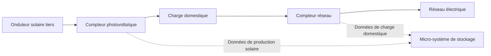

# Double comptage pour onduleurs tiers

## 1. Pourquoi le double comptage ?

Lorsqu’un système solaire tiers est déjà installé dans un foyer, celui-ci utilise généralement un **compteur réseau** pour mesurer les flux d’énergie entre la maison et le réseau électrique, afin de piloter le système de stockage :

- Lorsque le surplus d’énergie est injecté dans le réseau, la batterie est prioritairement chargée  
- Lorsque la consommation augmente, la batterie se décharge pour compenser  
- La consommation d’électricité depuis le réseau est minimisée autant que possible  

Cette approche permet un contrôle de base, mais le système ne voit que les échanges d’énergie entre la maison et le réseau. Il ne peut pas connaître directement la production solaire réelle.

Par exemple :

```text
Production solaire : 3000W
├─ Consommation domestique : 1000W
└─ Surplus injecté au réseau : 2000W
````

Dans ce cas, le compteur réseau ne peut détecter que 2000W injectés vers le réseau, mais il ne peut pas déterminer :

* La production solaire totale
* La part d’énergie solaire consommée directement par le foyer
* L’origine de l’énergie utilisée pour charger la batterie
* Le taux d’autoconsommation solaire

Par conséquent, le système ne peut pas fournir une analyse énergétique complète du foyer.

---

## 2. Solution

En ajoutant un **compteur photovoltaïque** en complément du compteur réseau existant :

* Le compteur réseau mesure les échanges entre le foyer et le réseau électrique
* Le compteur photovoltaïque mesure la production de l’onduleur solaire

Avec ces deux sources de données, le système peut reconstituer précisément les flux énergétiques du foyer.

---

## 3. Compteurs photovoltaïques pris en charge

<table>
  <thead>
    <tr>
      <th>Marque</th>
      <th>Appareil</th>
      <th>Modèle</th>
    </tr>
  </thead>
  <tbody>
    <tr>
      <td>INDEVOLT</td>
      <td>Compteur</td>
      <td>SMD1<br />SMD3</td>
    </tr>
    <tr>
      <td>SOLARMAN</td>
      <td>Compteur</td>
      <td>
        MR1-D4-WRE-B<br />
        MR1-D5-W<br />
        MR3-D5-WR<br />
        MR1-D4-WE-B<br />
        MR1-D5-WR<br />
        MR3-D4-WE-B<br />
        MR3-D5-W<br />
        MR3-D4-WRE-B
      </td>
    </tr>
    <tr>
      <td>Shelly</td>
      <td>Compteur</td>
      <td>
        Pro 3 EM (400)<br />
        Shelly 3EM<br />
        Shelly Pro EM<br />
        Pro 3 EM - 3CT63
      </td>
    </tr>
  </tbody>
</table>

---

## 4. Schéma de connexion

Le schéma global est le suivant :



### Compteur réseau

Généralement installé au point de raccordement au réseau ou à proximité du tableau électrique.

Fonctions principales :

* Mesurer la consommation totale du foyer
* Déterminer si l’énergie est importée ou exportée
* Fournir une base de contrôle pour la charge et la décharge de la batterie

### Compteur photovoltaïque

Installé côté sortie AC de l’onduleur photovoltaïque tiers.

Fonctions principales :

* Mesurer la puissance réelle de production solaire
* Transmettre les données de production au système
* Fournir les données de base côté production

---

## 5. Configuration dans l’application

Après installation, les deux compteurs doivent être configurés dans l’application.

| Type de compteur | Source de données |
| ---------------- | ----------------- |
| Compteur réseau  | Réseau            |
| Compteur solaire | Solaire           |

1. Ouvrir l’application INDEVOLT et vérifier que les deux compteurs sont bien ajoutés et en ligne.
2. Aller dans **Profil** > **Sources de données**.
3. Cliquer sur **Réseau** ou **Solaire**.
4. Sélectionner **Personnalisé**.
5. Définir le compteur réseau comme source **Réseau**.
6. Définir le compteur photovoltaïque comme source **Solaire**.
7. Enregistrer la configuration.


