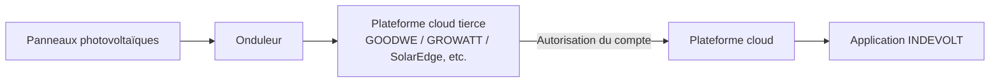
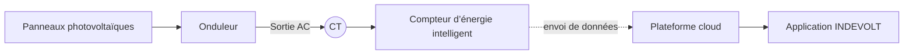

# Intégration d’un onduleur tiers

Si vous avez installé un onduleur photovoltaïque d’une autre marque à votre domicile, vous pouvez l’intégrer à la plateforme cloud via les méthodes suivantes afin de :

- Consulter en temps réel la production photovoltaïque
- Analyser la consommation domestique et les flux d’énergie excédentaire
- Optimiser les stratégies de charge et de décharge du système de stockage

Deux méthodes d’intégration sont actuellement prises en charge :

1. [Connexion via plateforme cloud (Cloud-to-Cloud)](#méthode-1--connexion-cloud-to-cloud)
2. [Collecte des données via prise intelligente ou compteur d’énergie](#méthode-2--collecte-des-données-via-prise-ou-compteur)

---

## Méthode 1 : Connexion cloud-to-cloud

### Scénarios pris en charge

Marques actuellement supportées :

- GOODWE
- GROWATT
- FusionSolar
- SolarEdge
- SolaX
- Solplanet

D’autres marques seront ajoutées progressivement.

### Principe de fonctionnement

En liant votre compte de plateforme énergétique tierce, l’application peut accéder directement aux données de l’onduleur associées à ce compte.

### Étapes de configuration

1. Ouvrez l’application INDEVOLT et accédez à la page **Profil**.
2. Appuyez sur **Intégrations énergétiques**.
3. Sélectionnez la marque de votre onduleur.
4. Suivez les instructions pour vous connecter et autoriser le compte tiers.
5. Une fois l’autorisation terminée, le système synchronise automatiquement la liste des appareils et les ajoute au domicile.

👉 Guide détaillé d’autorisation : [Connexion à une marque énergétique](https://docs.indevolt.com/fr/docs/category/brand-connection)

---

## Méthode 2 : Collecte des données via prise ou compteur

**Prise intelligente**

**Compteur d’énergie**

### Principe de fonctionnement

La prise intelligente ou le compteur d’énergie mesure la puissance de sortie de l’onduleur et utilise ces données comme production photovoltaïque pour les statistiques énergétiques.

### Étapes de configuration

#### Étape 1 : Installer l’équipement de mesure

Choisissez l’une des deux solutions suivantes selon votre situation :

<u>Solution A : prise intelligente</u>

- Connecter la sortie AC de l’onduleur à la prise

<u>Solution B : compteur d’énergie + CT</u>

- Le compteur est connecté au circuit domestique pour mesurer la tension
- Le CT est installé sur la ligne de sortie AC de l’onduleur afin de mesurer le courant et sa direction

#### Étape 2 : Ajouter l’appareil

Ajoutez la prise intelligente ou le compteur d’énergie dans l’application INDEVOLT et assurez-vous que l’appareil est en ligne.

#### Étape 3 : Configurer la source de données

1. Ouvrez l’application.
2. Accédez à **Profil > Source De Données**.
3. Dans la source de données **Solaire**, appuyez sur **Personnalisé**.
4. Sélectionnez la prise ou le compteur utilisé pour les statistiques énergétiques.
5. Enregistrez la configuration.

Une fois la configuration terminée, le système identifie automatiquement les données de puissance collectées comme production photovoltaïque et les utilise pour l’analyse des flux énergétiques, les statistiques de production et le tableau de bord énergétique.

:::warning
* Assurez-vous que l’équipement de mesure est installé sur le circuit de sortie de l’onduleur.
* Une mauvaise orientation du CT peut entraîner des valeurs de puissance négatives ou incorrectes.
* Cette méthode est une mesure indirecte ; de légères différences peuvent exister par rapport aux valeurs affichées par l’onduleur.
:::