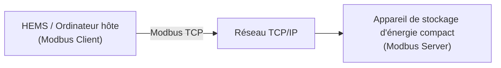

# Présentation de Modbus

Modbus est un protocole de communication largement utilisé dans les domaines de l'automatisation industrielle et de la gestion de l'énergie. Il permet l'échange de données entre différents appareils.

Grâce à Modbus, les systèmes de gestion de l'énergie domestique (HEMS), les ordinateurs hôtes ou les systèmes tiers peuvent lire l'état de fonctionnement des appareils de stockage d'énergie compacts et envoyer des commandes de contrôle selon les besoins.

---

## 1. Modbus TCP / RTU

Les appareils de stockage d'énergie compacts prennent en charge les deux méthodes de communication Modbus suivantes :

- **Modbus TCP** : transmet les données Modbus via Ethernet. Une fois l'appareil connecté au réseau local, le HEMS ou l'ordinateur hôte peut accéder au système de stockage via son adresse IP pour lire les données et effectuer des opérations de contrôle.
- **Modbus RTU** : transmet les données Modbus via un bus RS485. Les appareils sont connectés par des câbles de communication RS485 et l'appareil maître interroge les appareils pour lire les données. (Non pris en charge pour le moment, à venir.)

Les deux méthodes utilisent le même protocole Modbus et permettent d'accéder aux mêmes données d'appareil. La seule différence concerne le support de communication et la méthode de connexion.

---

## 2. Principe de fonctionnement

Modbus utilise un modèle de communication **Client / Serveur**. Selon le scénario d'application, le système de stockage d'énergie compact peut fonctionner comme un Modbus Server ou un Modbus Client.

### 2.1 Fonctionnement en tant que Modbus Server

Lorsque le système de stockage d'énergie compact fonctionne comme Modbus Server, un système externe (tel qu'un HEMS ou un ordinateur hôte) agit comme Modbus Client pour accéder à l'appareil.



1. Le Client envoie une demande de lecture ou d'écriture à l'appareil de stockage.
2. La demande est transmise à l'appareil via TCP/IP.
3. L'appareil lit les données des registres correspondants ou exécute les commandes de contrôle.
4. L'appareil renvoie le résultat de l'exécution.
5. Le Client affiche, enregistre les données ou effectue un contrôle automatique selon les informations reçues.

### 2.2 Fonctionnement en tant que Modbus Client

Lorsque le système de stockage d'énergie compact fonctionne comme Modbus Client, il peut se connecter à un Modbus TCP Server tiers, lire les données des appareils et réaliser une gestion de l'énergie ainsi qu'une interaction entre appareils.


1. L'appareil de stockage envoie une demande de lecture au Modbus Server tiers.
2. L'appareil tiers renvoie les données des registres correspondants.
3. L'appareil de stockage effectue la gestion de l'énergie et l'interaction entre appareils selon les données obtenues.

---

## 3. Appareils compatibles

Cette fonction s'applique aux appareils prenant en charge Modbus :

| Modèle                                                                                                                        | Version minimale du firmware prise en charge |
| ----------------------------------------------------------------------------------------------------------------------------- | -------------------------------------------- |
| PowerFlex 2000<br />PowerFlex 2000 Eco<br />SolidFlex 2000<br />SolidFlex 2000 Eco                                            | CMS : V140C.0B.0036<br />EMS : V1.01.08      |
| PowerFlex 3000 AC<br />PowerFlex 3000 Hybrid<br />SolidFlex 3000 AC<br />SolidFlex 3000 AC Pro<br />SolidFlex 3000 Hybrid Pro | CMS : V140C.09.3036                          |
| SolidFlex 1200                                                                                                                | CMS : V140B.09.2036                          |

---

## 4. Utilisation

### 4.1 Préparation

Avant de commencer, vérifiez les points suivants :

* ✅ L'appareil prend en charge la fonction Modbus.
* ✅ L'appareil fonctionne normalement.
* ✅ La connexion réseau ou le câblage RS485 est terminé.

:::info
Si l'appareil prend actuellement uniquement en charge la communication Wi-Fi, vous pouvez remplacer le module de communication par une version plus récente (prenant en charge le Wi-Fi, Ethernet et le port série RS485) lorsqu'une connexion réseau filaire ou une communication RS485 est nécessaire.

Pour plus d'informations sur le remplacement, consultez : [Remplacement des accessoires](../advanced/accessory-replacement.md)
:::

### 4.2 Activer Modbus

La fonction Modbus est désactivée par défaut et doit être activée manuellement dans l'application.

### 4.3 Configurer les paramètres de communication

Configurez les paramètres suivants dans le système tiers ou l'outil Modbus :

**Modbus TCP**

| Paramètre                | Description                                        |
| ------------------------ | -------------------------------------------------- |
| Adresse IP de l'appareil | Adresse IP du système de stockage                  |
| Port TCP                 | Valeur par défaut : `8899`                         |
| Slave ID                 | Identifiant de l'appareil, valeur par défaut : `1` |

### 4.4 Lire les données

Une fois la connexion établie, vous pouvez lire les registres de l'appareil. Pour les adresses des registres, consultez [Description des registres Modbus](./modbus-register-table.md).

## 5. Fréquence de lecture recommandée

| Type                                  | Limite       |
| ------------------------------------- | ------------ |
| Intervalle de requête recommandé      | ≥ 5 secondes |
| Intervalle minimal entre les requêtes | 1 seconde    |
| Temps de réponse                      | 1 seconde    |

Des lectures trop fréquentes peuvent augmenter la charge de communication de l'appareil et affecter la stabilité de la communication.

## 6. Codes de fonction courants

| Code de fonction | Description                                             |
| ---------------- | ------------------------------------------------------- |
| `0x03`           | Lire les registres de maintien (Read Holding Registers) |
| `0x04`           | Lire les registres d'entrée (Read Input Registers)      |
| `0x06`           | Écrire un seul registre (Write Single Register)         |
| `0x10`           | Écrire plusieurs registres (Write Multiple Registers)   |

## 7. Exemple Python

```python
from pymodbus.client import ModbusTcpClient

client = ModbusTcpClient(
    host="190.160.3.167",
    port=8899
)

client.connect()

result = client.read_holding_registers(
    address=0x0478,
    count=1,
    device_id=1
)

print(result.registers)

client.close()
```

---

## 8. FAQ

<details>
  <summary>**Q : Impossible de se connecter à l'appareil**</summary>

Vérifiez les points suivants :

* La fonction Modbus est-elle activée sur l'appareil ?
* Le Client et l'appareil sont-ils sur le même réseau local (Modbus TCP) ?
* Le câblage RS485 est-il correct (Modbus RTU) ?
* Les paramètres de communication sont-ils corrects ?

</details>

<details>
  <summary>**Q : Échec de lecture des données**</summary>

Vérifiez les points suivants :

* La connexion fonctionne-t-elle correctement ?
* Le code de fonction est-il correct ?
* L'adresse du registre est-elle correcte ?
* Le type de données correspond-il ?

</details>
