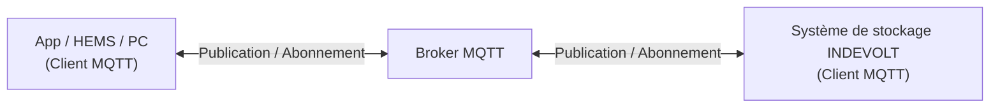

# Présentation de MQTT

MQTT (*Message Queuing Telemetry Transport*) est un protocole de communication léger basé sur le modèle **publication/abonnement** (*Publish/Subscribe*). Il est largement utilisé dans l'Internet des objets (IoT) pour l'échange de données en temps réel entre les appareils.

Les systèmes de stockage d'énergie INDEVOLT prennent en charge la communication avec des systèmes tiers via MQTT, notamment pour :

- Obtenir l'état de fonctionnement des appareils en temps réel
- Recevoir les événements et les alertes des appareils
- Envoyer des commandes de contrôle aux appareils
- Intégrer Home Assistant, des systèmes EMS ou d'autres plateformes de gestion de l'énergie

MQTT est particulièrement adapté aux scénarios nécessitant un grand nombre d'appareils, une bande passante réseau limitée ou une communication en temps réel.

---

## 1. Principe de fonctionnement

MQTT utilise un modèle de communication **publication/abonnement**. Tous les clients communiquent via un **MQTT Broker** et n'échangent pas directement de messages entre eux.

| Composant                    | Rôle        | Description                                                                                              |
| ---------------------------- | ----------- | -------------------------------------------------------------------------------------------------------- |
| App / HEMS / PC              | Client MQTT | Se connecte au Broker MQTT pour s'abonner aux données des appareils ou envoyer des commandes de contrôle |
| Broker MQTT                  | Broker MQTT | Serveur de messages chargé de recevoir, filtrer et transférer les messages MQTT                          |
| Système de stockage INDEVOLT | Client MQTT | Se connecte au Broker MQTT pour publier les données de l'appareil et recevoir les commandes de contrôle  |

Le fonctionnement est le suivant :

1. Le système de stockage se connecte au Broker MQTT. Selon la configuration du Broker, une communication chiffrée TLS/SSL peut être utilisée.
2. L'appareil publie activement ses données de fonctionnement vers le Broker MQTT.
3. L'application ou le système tiers s'abonne au Topic correspondant.
4. Le Broker MQTT reçoit les messages publiés et les transmet à tous les abonnés concernés.
5. L'utilisateur peut publier des commandes de contrôle vers un Topic spécifique.
6. L'appareil reçoit la commande et exécute l'action correspondante.

---

## 2. Appareils compatibles

Cette fonctionnalité est disponible pour les appareils prenant en charge MQTT :

| Modèle                                                                                                                        | Version minimale du firmware applicable |
| ----------------------------------------------------------------------------------------------------------------------------- | --------------------------------------- |
| PowerFlex 2000 PowerFlex 2000 Eco SolidFlex 2000 SolidFlex 2000 Eco                                            | CMS : V140C.0B.0036 EMS : V1.01.08 |
| PowerFlex 3000 AC PowerFlex 3000 Hybrid SolidFlex 3000 AC SolidFlex 3000 AC Pro SolidFlex 3000 Hybrid Pro | CMS : V140C.09.3036                     |
| SolidFlex 1200                                                                                                                | CMS : V140B.09.2036                     |

---

## 3. Utilisation

### 3.1 Conditions préalables

Avant d'utiliser MQTT, assurez-vous que :

* ✅ L'appareil est correctement alimenté
* ✅ L'appareil est connecté au réseau
* ✅ L'appareil prend en charge la fonction MQTT

### 3.2 Activation de MQTT

La fonction MQTT est désactivée par défaut. Elle doit être activée manuellement dans l'application, puis les informations du Broker MQTT doivent être configurées.

### 3.3 Paramètres de connexion MQTT

| Paramètre         | Description                                                                                          |
| ----------------- | ---------------------------------------------------------------------------------------------------- |
| Adresse du Broker | Adresse du Broker MQTT, pouvant être l'adresse IP d'un serveur local ou l'adresse d'un serveur cloud |
| Port              | 1883 (non chiffré) / 8883 (chiffrement TLS/SSL)                                                      |
| Client ID         | Utilise par défaut le numéro de série de l'appareil (SN)                                             |
| Nom d'utilisateur | Identifiant de connexion MQTT, vide par défaut et personnalisable                                    |
| Mot de passe      | Mot de passe de connexion MQTT, vide par défaut et personnalisable                                   |
| TLS               | Indique si le chiffrement TLS est activé                                                             |
| Certificat CA     | Certificat CA utilisé en mode TLS (si nécessaire)                                                    |
| Keep Alive        | 60 secondes par défaut                                                                               |

---

## 4. Topic

Un **Topic** permet d'identifier la catégorie et le routage d'un message MQTT. Il est similaire à un chemin dans un système de fichiers (par exemple : `energy/device1/soc`). Le Broker MQTT utilise le Topic pour transférer les messages aux abonnés correspondants.

MQTT permet de s'abonner à un Topic unique ou d'utiliser des **caractères génériques** pour effectuer des abonnements multiples.

| Caractère générique | Fonction                      | Exemple                                                                                                                                                                                    |
| ------------------- | ----------------------------- | ------------------------------------------------------------------------------------------------------------------------------------------------------------------------------------------ |
| `+`                 | Correspond à un seul niveau   | `energy/+/soc` Peut correspondre à `energy/device1/soc` et `energy/device2/soc`. Ne correspond pas à `energy/group/device1/soc`, car celui-ci contient un niveau supplémentaire. |
| `#`                 | Correspond à tous les niveaux | `energy/#` Permet de s'abonner à tous les Topics sous `energy`, notamment : `energy/device1/soc`, `energy/device1/power`, `energy/device2/status`.                                    |

Pour la définition complète des Topics, consultez : [MQTT Topic](./mqtt-topic.md)

---

## 5. QoS

QoS (*Quality of Service*) indique le niveau de fiabilité de la transmission des messages.

| QoS   | Description                                                                |
| ----- | -------------------------------------------------------------------------- |
| QoS 0 | Envoi au maximum une fois. Le plus rapide, mais sans garantie de réception |
| QoS 1 | Envoi au moins une fois. Des messages en double peuvent être reçus         |
| QoS 2 | Envoi exactement une fois. Niveau de fiabilité maximal                     |

Recommandations générales :

* Données d'état en temps réel : QoS 0 ou QoS 1
* Commandes de contrôle : QoS 1

---

## 6. FAQ

  
**Q : Impossible de se connecter à MQTT**

Vérifiez les points suivants :

* L'adresse du Broker est correcte
* Le nom d'utilisateur et le mot de passe sont corrects
* La connexion réseau fonctionne correctement
* Le chiffrement TLS est activé ou non selon la configuration

  
**Q : Pourquoi aucune donnée n'est reçue après l'abonnement ?**

Vérifiez les points suivants :

* Le Topic est correct
* Les majuscules et minuscules du Topic correspondent exactement
* Le niveau du Topic souscrit est correct
* L'appareil est connecté et en ligne

