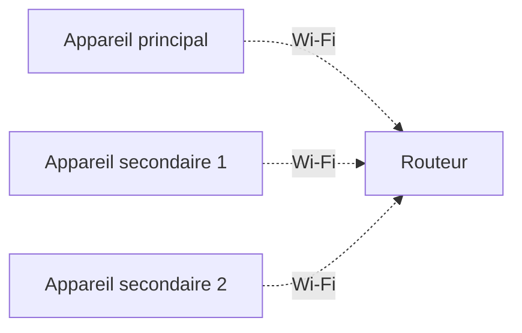
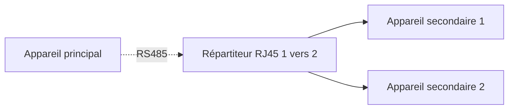

# Guide du Cluster

## 1. Qu’est-ce que le cluster ?

Le mode Cluster permet de connecter plusieurs unités de stockage d’énergie en un seul système fonctionnant de manière coordonnée, afin d’assurer ensemble l’alimentation, le stockage et la gestion de l’énergie.

Dans un cluster, une unité doit être définie comme appareil principal. Elle est responsable du contrôle global et de la coordination du système, tandis que les autres unités fonctionnent comme appareils secondaires. Les appareils communiquent automatiquement entre eux et travaillent de manière synchronisée.

Après la mise en parallèle, la puissance totale de sortie et la capacité totale de stockage augmentent, ce qui convient particulièrement aux charges importantes, aux besoins d’alimentation de secours longue durée ou aux extensions futures.

---

## 2. Pourquoi utiliser le cluster ?

La puissance et la capacité d’un seul appareil sont limitées. Lorsque la consommation du foyer augmente ou qu’une autonomie plus longue est souhaitée, le cluster permet d’étendre les capacités du système.

**Augmentation de la puissance de sortie**

Plusieurs appareils peuvent fournir de l’énergie simultanément afin d’alimenter des charges plus importantes.

> Exemple :
> - 1 appareil SolidFlex 2000 : puissance maximale de l’onduleur d’environ 2400 W
> - 2 appareils en parallèle : puissance maximale d’environ 4800 W
> - La puissance réellement disponible reste soumise aux limites du réseau, du câblage et des réglementations locales.

**Augmentation de la capacité de stockage**

Après la mise en parallèle, les batteries de tous les appareils participent ensemble au stockage d’énergie, ce qui permet d’allonger significativement la durée d’alimentation.

> Exemple :
> - 1 SolidFlex 2000 avec 5 modules SFA1800 : capacité totale de 10,8 kWh
> - 2 systèmes en parallèle : capacité totale d’environ 21,6 kWh

**Extension flexible**

Le système permet une extension progressive. Les utilisateurs peuvent commencer avec un seul appareil puis ajouter de nouvelles unités selon leurs besoins, sans devoir installer l’ensemble du système dès le départ.

---

## 3. Appareils compatibles

Les modèles suivants peuvent être utilisés comme appareil principal ou secondaire :

<table><thead>
  <tr>
    <th></th>
    <th colspan="2">Cluster centralisé</th>
    <th colspan="2">Cluster coordonné</th>
  </tr></thead>
<tbody>
  <tr>
    <td>Modèle</td>
    <td>Principal</td>
    <td>Secondaire</td>
    <td>Principal</td>
    <td>Secondaire</td>
  </tr>
  <tr>
    <td>BK1600</td>
    <td>❌</td>
    <td>✅</td>
    <td>✅</td>
    <td>✅</td>
  </tr>
  <tr>
    <td>BK1600 Ultra</td>
    <td>✅</td>
    <td>✅</td>
    <td>✅</td>
    <td>✅</td>
  </tr>
  <tr>
    <td>SolidFlex 2000 PowerFlex 2000 SolidFlex 2000 Eco PowerFlex 2000 Eco</td>
    <td>✅</td>
    <td>✅</td>
    <td>✅</td>
    <td>✅</td>
  </tr>
    <tr>
    <td>SolidFlex 1200</td>
    <td>✅</td>
    <td>✅</td>
    <td>✅</td>
    <td>✅</td>
  </tr>
  <tr>
    <td>SolidFlex 3000 AC SolidFlex 3000 AC Pro SolidFlex 3000 Hybrid Pro PowerFlex 3000 AC PowerFlex 3000 Hybrid</td>
    <td>✅</td>
    <td>✅</td>
    <td>✅</td>
    <td>✅</td>
  </tr>
</tbody>
</table>

:::info

- Le fonctionnement en cluster entre les modèles SolidFlex / PowerFlex et la série BK n’a pas été entièrement validé et n’est donc pas recommandé. Toutefois, les modèles SolidFlex et PowerFlex peuvent être utilisés ensemble dans un même cluster.
- En mode cluster :
  - Les panneaux photovoltaïques peuvent être connectés via les interfaces **PV**
  - La connexion de micro-onduleurs et de charges via l’interface **Backup** est encore en cours d’optimisation et n’est pas totalement prise en charge pour le moment

:::

---

## 4. Mode Cluster

Le système prend en charge un maximum de **3 appareils connectés en cluster** :

- 1 appareil principal
- Jusqu’à 2 appareils secondaires

Selon l’environnement d’installation, les deux modes de connexion en cluster suivants peuvent être sélectionnés :

### 4.1 Cluster coordonné

Chaque appareil est connecté individuellement au réseau et gère séparément son entrée et sa sortie AC. Les appareils synchronisent leurs données via le réseau de communication, tandis que l’appareil principal coordonne l’état de fonctionnement et la répartition de puissance.

import Tabs from '@theme/Tabs';
import TabItem from '@theme/TabItem';

<Tabs>
  <TabItem value="gen1" label="SolidFlex / PowerFlex" default>
    
  </TabItem>
  <TabItem value="gen2" label="BK1600 / BK1600 Ultra">
    
  </TabItem>
</Tabs>

### 4.2 Cluster centralisé

Les appareils secondaires sont reliés successivement à l’appareil principal par des câbles d’alimentation. Toutes les entrées et sorties AC sont regroupées sur l’appareil principal, qui assure la connexion au réseau et la gestion globale des flux d’énergie.

Méthode de connexion :
- L’appareil principal est connecté au réseau via **GRID IN/OUT**
- Le port **Backup** du principal est connecté au **GRID IN/OUT** du premier appareil secondaire
- En présence de plusieurs appareils secondaires, ils sont reliés en cascade via **Backup → GRID IN/OUT**

<Tabs>
  <TabItem value="gen1" label="SolidFlex / PowerFlex" default>
    
  </TabItem>
  <TabItem value="gen2" label="BK1600 / BK1600 Ultra">
    
  </TabItem>
</Tabs>

---

## 5. Méthodes de communication

Les appareils doivent maintenir une communication entre eux afin de synchroniser leur état de fonctionnement. Deux méthodes de communication sont prises en charge :

### 5.1 Communication Wi-Fi

Connectez tous les appareils au même réseau Wi-Fi. Cette méthode convient aux installations où les appareils sont proches les uns des autres et où un réseau Wi-Fi stable est disponible.

### 5.2 Communication RS485

Connectez l’appareil principal et les appareils secondaires via les ports RS485 à l’aide d’un câble réseau. Cette méthode convient aux environnements avec une connexion réseau insuffisante ou aux scénarios nécessitant une communication filaire stable.

Pour connecter deux appareils secondaires, utilisez un **répartiteur RJ45 1 vers 2** afin de connecter l’appareil principal aux appareils secondaires.

**Brochage RJ45**

| Broche | Signal | Fonction |
| --- | --- | --- |
| 1 | GND | Masse du blindage |
| 2 | GND | Masse du blindage |
| 3 | N.C. | Non connecté |
| 4 | RS485 A | Signal différentiel RS485 A (pour INDEVOLT Smart CT) |
| 5 | RS485 B | Signal différentiel RS485 B (pour INDEVOLT Smart CT) |
| 6 | N.C. | Non connecté |
| 7 | DC 5V | Alimentation 5 V, courant maximal : 200 mA |
| 8 | DC 5V | Alimentation 5 V, courant maximal : 200 mA |

:::info
Si l’appareil prend actuellement uniquement en charge le Wi-Fi et qu’une connexion en cluster via RS485 est nécessaire, le module de communication peut être remplacé par une version plus récente. Pour plus d’informations, consultez : [Remplacement d'accessoire](../advanced/accessory-replacement.md)
:::

## 6. Limites de puissance du système en cluster

Après la mise en cluster, la puissance maximale du système dépend de :

* Mode cluster
* Modèle d’appareil

À noter :

* La **puissance d’entrée AC** détermine la puissance maximale que le système peut prélever depuis le réseau électrique.
* La **puissance de sortie AC** détermine la puissance maximale que le système peut fournir aux charges.

:::danger
Assurez-vous que la puissance maximale de sortie du système respecte les normes électriques locales et les réglementations de sécurité.
:::

### 6.1 Puissance d’un appareil individuel

Les capacités maximales d’entrée/sortie AC des différents modèles sont les suivantes :

| Modèle     | Puissance maximale d’entrée/sortie AC |
| ---------- | ------------------------------------- |
| Série BK   | 1200 W                                |
| Série 2000 | 2400 W                                |
| Série 1200 | 1200 W                                |
| Série 3000 | 3000 W                                |

### 6.2 Puissance maximale d’entrée AC

Après la connexion en cluster, plusieurs appareils peuvent effectuer une entrée AC simultanément.

Puissance maximale d’entrée AC du cluster = somme des puissances maximales d’entrée AC de tous les appareils connectés en cluster

### 6.3 Puissance maximale de sortie AC

La puissance maximale de sortie AC après la mise en cluster dépend du mode de connexion.

* **Cluster coordonné :**
  Puissance maximale de sortie AC du cluster = somme des puissances maximales de sortie AC de tous les appareils connectés en cluster

* **Cluster centralisé :**
  Les entrées et sorties AC de tous les appareils sont finalement connectées au réseau électrique via l’appareil principal. Par conséquent, la puissance de sortie AC est limitée par la capacité de puissance de l’appareil principal.

  | Modèle principal | Puissance maximale de sortie AC du cluster |
  | ---------------- | ------------------------------------------ |
  | BK1600 Ultra     | 2300 W                                     |
  | Série 2000       | 3600 W                                     |
  | Série 1200       | 2300 W                                     |
  | Série 3000       | 3600 W                                     |

:::note
En fonctionnement en cluster, la connexion de micro-onduleurs et de charges via le port bypass peut entraîner une indication de puissance incorrecte. Cette fonction est toujours en cours d’optimisation.
:::

---

## 7. Répartition de puissance

En fonctionnement parallèle, le système répartit automatiquement la puissance selon le niveau de batterie et la charge :

- La puissance de sortie peut différer d’un appareil à l’autre
- Tous les appareils ne participent pas nécessairement simultanément
- Les appareils ayant le SOC le plus élevé sont prioritaires

Comportement typique selon la charge :

| Puissance de charge | Comportement du système |
| ------------------- | ----------------------- |
| Inférieure à 200 W  | Un seul appareil avec le SOC le plus élevé fournit l’énergie |
| 200 W à 500 W       | Les deux appareils avec le SOC le plus élevé partagent la charge |
| Supérieure à 500 W  | Tous les appareils participent, avec une répartition proportionnelle au SOC |

---

## 8. Comment configurer le cluster

La configuration peut être effectuée via l’application INDEVOLT.

Avant de commencer, assurez-vous que :

- Tous les appareils prennent en charge le cluster
- Tous les appareils sont correctement allumés
- Tous les appareils sont correctement connectés au réseau et ajoutés au même domicile.
- Pour un fonctionnement en parallèle via RS485, les câbles de communication sont correctement connectés.

### Étape 1 : Accéder aux paramètres de cluster

Dans la page de détails de l’appareil, appuyez sur l’icône  en haut à droite pour accéder aux paramètres, puis sélectionnez **Cluster**.

Appuyez sur **Créer un cluster** pour commencer.

### Étape 2 : Sélectionner le mode Cluster

Sélectionnez le mode Cluster : **centralisé** ou **coordonné**.

### Étape 3 : Ajouter les appareils principaux et secondaires

Dans la liste des appareils compatibles, maintenez appuyée la carte de l’appareil puis faites-la glisser dans la zone principale ou secondaire.

### Étape 4 : Sélectionner la méthode de communication

Sélectionnez la méthode de communication entre les appareils en parallèle : **Wi-Fi** ou **RS485**.

Si la **communication RS485** est sélectionnée :

- L'appareil doit être équipé d'un module LAN prenant en charge la communication RS485.
- Utilisez un câble réseau standard pour connecter le port RS485 de l'appareil.

### Étape 5 : Configurer les paramètres du cluster

Configurez les paramètres de base du cluster, notamment le nom du groupe et les limites liées à la puissance, puis appuyez sur **Enregistrer** pour terminer la création.

:::danger
Assurez-vous que les paramètres configurés sont conformes aux exigences du réseau électrique local ainsi qu'aux lois et réglementations applicables.
:::

### Étape 6 : Consulter et gérer le cluster

Une fois la configuration terminée, l’application ouvre automatiquement la page de détails du cluster. Vous pouvez y consulter l’état du système, les relations entre appareils principaux et secondaires, la puissance en temps réel et les stratégies énergétiques.

Appuyez sur l’icône  en haut à droite pour accéder aux paramètres avancés et gérer le cluster, par exemple modifier les paramètres ou dissocier les appareils.

