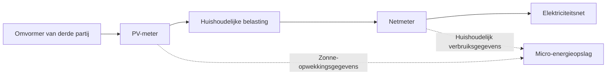

# Dubbel meten bij omvormers van derden

## 1. Waarom dubbel meten?

Wanneer een huishouden al een zonne-omvormer van een derde partij heeft geïnstalleerd, wordt er doorgaans een **netmeter** gebruikt om de energiestroom tussen de woning en het elektriciteitsnet te meten en het opslagsysteem aan te sturen:

- Wanneer er overtollige energie wordt teruggeleverd aan het net, wordt de batterij met prioriteit geladen  
- Wanneer het huishoudelijk verbruik toeneemt, levert de batterij extra energie  
- Het afnemen van elektriciteit van het net wordt zoveel mogelijk geminimaliseerd  

Deze aanpak maakt basisregeling mogelijk, maar het systeem ziet alleen de energiestroom tussen woning en net. Het kan niet direct bepalen hoeveel zonne-energie daadwerkelijk wordt opgewekt.

Bijvoorbeeld:

```text
Zonne-opwekking 3000W
├─ Huishoudelijk verbruik 1000W
└─ Teruglevering aan het net 2000W
````

In dit geval kan de netmeter alleen 2000W teruglevering detecteren, maar niet:

* Hoeveel zonne-energie er in totaal is opgewekt
* Hoeveel zonne-energie direct door het huishouden is gebruikt
* Waar de energie voor het laden van de batterij vandaan komt
* Het aandeel van zelfconsumptie van zonne-energie

Daarom kan het systeem geen volledig energieoverzicht van het huishouden geven.

---

## 2. Oplossing

Door een **extra PV-meter** toe te voegen naast de bestaande netmeter:

* De netmeter meet de energiestroom tussen woning en elektriciteitsnet
* De PV-meter meet de opwekking van de zonne-omvormer

Met deze twee gegevensbronnen kan het systeem de volledige energiestromen van het huishouden berekenen.

---

## 3. Ondersteunde PV-meters

<table>
  <thead>
    <tr>
      <th>Merk</th>
      <th>Apparaat</th>
      <th>Model</th>
    </tr>
  </thead>
  <tbody>
    <tr>
      <td>INDEVOLT</td>
      <td>Meter</td>
      <td>SMD1<br />SMD3</td>
    </tr>
    <tr>
      <td>SOLARMAN</td>
      <td>Meter</td>
      <td>
        MR1-D4-WRE-B<br />
        MR1-D5-W<br />
        MR3-D5-WR<br />
        MR1-D4-WE-B<br />
        MR1-D5-WR<br />
        MR3-D4-WE-B<br />
        MR3-D5-W<br />
        MR3-D4-WRE-B
      </td>
    </tr>
    <tr>
      <td>Shelly</td>
      <td>Meter</td>
      <td>
        Pro 3 EM (400)<br />
        Shelly 3EM<br />
        Shelly Pro EM<br />
        Pro 3 EM - 3CT63
      </td>
    </tr>
  </tbody>
</table>

---

## 4. Aansluitschema

De totale opzet is als volgt:



### Netmeter

Meestal geïnstalleerd op het aansluitpunt van het elektriciteitsnet of in de meterkast.

Belangrijkste functies:

* Meten van het totale huishoudelijke verbruik
* Bepalen of er stroom wordt afgenomen of teruggeleverd
* Basisinformatie leveren voor laad- en ontlaadregeling van de batterij


### PV-meter

Geïnstalleerd aan de AC-uitgangszijde van de zonne-omvormer van derden.

Belangrijkste functies:

* Meten van het daadwerkelijke zonne-opwekkingsvermogen
* Verzenden van opwekkingsdata naar het systeem
* Basisgegevens leveren voor de opwekkingszijde

---

## 5. App-configuratiestappen

Na installatie moeten beide meetapparaten in de app worden geconfigureerd.

| Meettype | Gegevensbron |
| -------- | ------------ |
| Netmeter | Net          |
| PV-meter | PV           |

1. Open de INDEVOLT App en controleer of beide meters online zijn toegevoegd.
2. Ga naar **Profiel** > **Gegevensbron**.
3. Klik op **Net** of **PV**.
4. Selecteer **Aangepast**.
5. Stel de netmeter in als **Net**-gegevensbron.
6. Stel de PV-meter in als **PV**-gegevensbron.
7. Sla de configuratie op.


