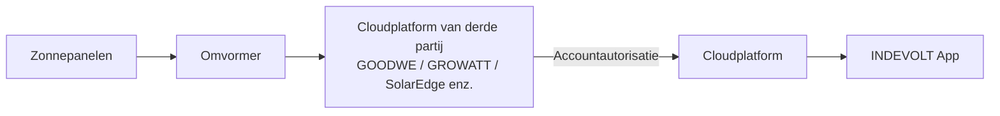
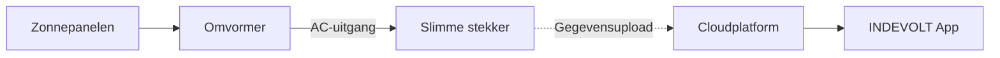
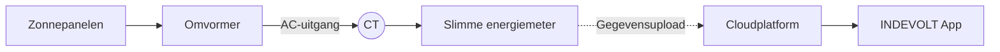

# Integratie van een externe omvormer

Als er al een zonne-omvormer van een ander merk in uw woning is geïnstalleerd, kunt u de omvormergegevens op een van de volgende manieren koppelen aan het cloudplatform. Hiermee kunt u:

- De zonne-energieopwekking in realtime bekijken
- Het huishoudelijke energieverbruik en de stroom van overtollige energie analyseren
- Laad- en ontlaadstrategieën voor energieopslag optimaliseren

Momenteel worden de volgende twee integratiemethoden ondersteund:

1. [Cloud-accountkoppeling (cloud-naar-cloud)](#methode-1-cloud-naar-cloud)
2. [Meting via slimme stekker of energiemeter](#methode-2-meting-via-slimme-stekker-of-energiemeter)

---

## Methode 1: Cloud-naar-cloud

### Toepasselijke situaties

De volgende merken worden momenteel ondersteund:

* GOODWE
* GROWATT
* FusionSolar
* SolarEdge
* SolaX
* Solplanet

Ondersteuning voor meer merken wordt in toekomstige updates toegevoegd.

### Werkingsprincipe

Door uw account van een extern energieplatform te koppelen, kan de App rechtstreeks de omvormergegevens ophalen die aan dat account zijn gekoppeld.

### Configuratiestappen

1. Open de INDEVOLT App en ga naar de pagina **Profiel**.
2. Tik op **Energie-Integraties**.
3. Selecteer het merk van uw omvormer.
4. Log in op het externe platform en geef toestemming volgens de instructies op het scherm.
5. Na succesvolle autorisatie synchroniseert het systeem automatisch de apparaten die aan dit account zijn gekoppeld en voegt deze toe aan uw woning.

👉 Gedetailleerde instructies: [Energie­merken verbinden](https://docs.indevolt.com/nl/docs/category/brand-connection)

---

## Methode 2: Meting via slimme stekker of energiemeter

**Slimme stekker**

**Slimme energiemeter**

### Werkingsprincipe

De slimme stekker of slimme energiemeter meet het uitgangsvermogen van de omvormer. De verzamelde gegevens worden vervolgens gebruikt als zonne-opwekkingsgegevens binnen de energiestatistieken.

### Configuratiestappen

#### Stap 1: Installeer het meetapparaat

Kies een van de volgende oplossingen op basis van uw situatie:

<u>Optie A: Slimme stekker</u>

- Sluit de AC-uitgang van de omvormer aan op de slimme stekker.

<u>Optie B: Slimme energiemeter + CT</u>

- Sluit de energiemeter aan op de huishoudelijke elektrische installatie om de spanning te meten.
- Plaats de CT-stroomtransformator rond de AC-uitgangskabel van de omvormer om de stroomrichting en stroomsterkte te meten.

#### Stap 2: Voeg het apparaat toe

Voeg de slimme stekker of slimme energiemeter toe in de INDEVOLT App en controleer of het apparaat online is.

#### Stap 3: Configureer de gegevensbron

1. Open de App.
2. Ga naar **Profiel** > **Gegevensbron**.
3. Tik onder de gegevensbron **PV** op **Aangepast**.
4. Selecteer de slimme stekker of energiemeter die moet worden gebruikt voor de energiestatistieken.
5. Sla de instellingen op.

Na de configuratie behandelt het systeem de door het geselecteerde apparaat gemeten vermogensgegevens automatisch als zonne-opwekkingsgegevens. Deze gegevens worden vervolgens gebruikt voor analyse van energiestromen in huis, statistieken over de energieopwekking en weergave op het energiedashboard.

:::warning
* Zorg ervoor dat het meetapparaat in het uitgangscircuit van de omvormer is geïnstalleerd.
* Een onjuiste installatierichting van de CT kan leiden tot negatieve of onjuiste vermogenswaarden.
* Dit is een indirecte meetmethode. De gemeten waarden kunnen daarom licht afwijken van de waarden die door de omvormer worden weergegeven.
:::