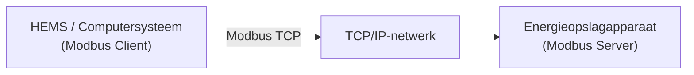

# Modbus-overzicht

Modbus is een veelgebruikt communicatieprotocol in industriële automatisering en energiebeheer, waarmee verschillende apparaten gegevens met elkaar kunnen uitwisselen.

Via Modbus kunnen Home Energy Management Systems (HEMS), computersystemen of systemen van derden de bedrijfsstatus van energieopslagapparaten uitlezen en indien nodig besturingsopdrachten verzenden.

---

## 1. Modbus TCP / RTU

INDEVOLT-energieopslagsystemen ondersteunen de volgende twee Modbus-communicatiemethoden:

- **Modbus TCP**: Modbus-gegevens worden via Ethernet verzonden. Nadat het apparaat met het lokale netwerk is verbonden, kunnen HEMS of computersystemen via het IP-adres van het apparaat toegang krijgen tot het energieopslagsysteem voor gegevensuitlezing en besturing.
- **Modbus RTU**: Modbus-gegevens worden via een RS485-bus verzonden. Apparaten worden via een RS485-communicatiekabel verbonden en het masterapparaat leest gegevens door middel van polling. (Momenteel niet ondersteund, wordt later beschikbaar gesteld.)

Beide methoden gebruiken hetzelfde Modbus-protocol en bieden toegang tot dezelfde apparaatgegevens. Het verschil zit alleen in het communicatiemedium en de verbindingsmethode.

---

## 2. Werkingsprincipe

Modbus gebruikt een **Client / Server**-communicatiemodel. Afhankelijk van de toepassing kan het energieopslagapparaat functioneren als Modbus Server of Modbus Client.

### 2.1 Als Modbus Server

Wanneer het energieopslagapparaat als Modbus Server werkt, fungeert een extern systeem (zoals HEMS of een computersysteem) als Modbus Client en maakt verbinding met het apparaat.



1. De Client stuurt lees- of schrijfverzoeken naar het energieopslagapparaat.
2. Het verzoek wordt via TCP/IP naar het apparaat verzonden.
3. Het energieopslagapparaat leest de betreffende registers of voert de besturingsopdracht uit.
4. Het energieopslagapparaat retourneert het uitvoeringsresultaat.
5. De Client gebruikt de gegevens voor weergave, opslag of automatische besturing.

### 2.2 Als Modbus Client

Wanneer het energieopslagapparaat als Modbus Client werkt, kan het verbinding maken met een derde-partij Modbus TCP Server om gegevens uit te lezen en energiebeheer en apparaatkoppeling te realiseren.


1. Het energieopslagapparaat stuurt leesverzoeken naar de Modbus Server van derden.
2. Het apparaat van derden retourneert de gegevens van de betreffende registers.
3. Het energieopslagapparaat gebruikt de ontvangen gegevens voor energiebeheer en apparaatkoppeling.

---

## 3. Geschikte apparaten

Deze functie is beschikbaar voor apparaten die Modbus ondersteunen:

| Model                                                                                                                         | Minimale firmwareversie               |
| ----------------------------------------------------------------------------------------------------------------------------- | ------------------------------------- |
| PowerFlex 2000<br />PowerFlex 2000 Eco<br />SolidFlex 2000<br />SolidFlex 2000 Eco                                            | CMS: V140C.0B.0036<br />EMS: V1.01.08 |
| PowerFlex 3000 AC<br />PowerFlex 3000 Hybrid<br />SolidFlex 3000 AC<br />SolidFlex 3000 AC Pro<br />SolidFlex 3000 Hybrid Pro | CMS: V140C.09.3036                    |
| SolidFlex 1200                                                                                                                | CMS: V140B.09.2036                    |

---

## 4. Gebruik

### 4.1 Voorbereiding

Controleer vóór gebruik het volgende:

* ✅ Het apparaat ondersteunt de Modbus-functie
* ✅ Het apparaat werkt normaal
* ✅ De netwerkverbinding of RS485-bedrading is voltooid

:::info
Als het apparaat momenteel alleen Wi-Fi-communicatie ondersteunt en een bekabelde netwerkverbinding of RS485-communicatie nodig is, kan de communicatiemodule worden vervangen door een nieuwe versie die Wi-Fi, Ethernet en RS485 ondersteunt.

Raadpleeg voor de vervangingsprocedure: [Accessoire vervangen](../advanced/accessory-replacement.md)
:::

### 4.2 Modbus inschakelen

De Modbus-functie is standaard uitgeschakeld en moet handmatig worden ingeschakeld via de App.


### 4.3 Communicatieparameters configureren

Configureer de volgende parameters in het systeem van derden of de Modbus-tool:

**Modbus TCP**

| Parameter   | Beschrijving                           |
| ----------- | -------------------------------------- |
| Apparaat-IP | IP-adres van het energieopslagapparaat |
| TCP-poort   | Standaard `8899`                       |
| Slave ID    | Apparaat-ID, standaard `1`             |


### 4.4 Gegevens uitlezen

Na een succesvolle verbinding kunnen de apparaatregisters worden uitgelezen. Raadpleeg [Modbus-registerbeschrijving](./modbus-register-table.md) voor de registeradressen.

---

## 5. Aanbevolen uitleesfrequentie

| Type                          | Limiet       |
| ----------------------------- | ------------ |
| Aanbevolen aanvraaginterval   | ≥ 5 seconden |
| Minimaal ondersteund interval | 1 seconde    |
| Responstijd                   | 1 seconde    |

Veelvuldig uitlezen kan de communicatiebelasting van het apparaat verhogen en de stabiliteit van de communicatie beïnvloeden.

---

## 6. Veelgebruikte functiecodes

| Functiecode | Beschrijving                                              |
| ----------- | --------------------------------------------------------- |
| `0x03`      | Holding registers lezen (*Read Holding Registers*)        |
| `0x04`      | Input registers lezen (*Read Input Registers*)            |
| `0x06`      | Eén register schrijven (*Write Single Register*)          |
| `0x10`      | Meerdere registers schrijven (*Write Multiple Registers*) |

---

## 7. Python-voorbeeld

```python
from pymodbus.client import ModbusTcpClient

client = ModbusTcpClient(
    host="190.160.3.167",
    port=8899
)

client.connect()

result = client.read_holding_registers(
    address=0x0478,
    count=1,
    device_id=1
)

print(result.registers)

client.close()
```

---

## 8. FAQ

<details>
  <summary>**Q: Kan geen verbinding maken met het apparaat**</summary>

Controleer het volgende:

* Of Modbus is ingeschakeld op het apparaat
* Of de Client en het apparaat zich in hetzelfde lokale netwerk bevinden (Modbus TCP)
* Of de RS485-bedrading correct is aangesloten (Modbus RTU)
* Of de communicatieparameters correct zijn ingesteld

</details>

<details>
  <summary>**Q: Gegevens kunnen niet worden uitgelezen**</summary>

Controleer het volgende:

* Of de verbinding normaal werkt
* Of de functiecode correct is
* Of het registeradres correct is
* Of het gegevenstype overeenkomt

</details>
