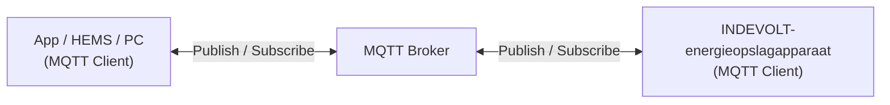

# MQTT-overzicht

MQTT (*Message Queuing Telemetry Transport*) is een lichtgewicht berichtencommunicatieprotocol gebaseerd op het **publish/subscribe**-model. Het wordt veel gebruikt voor realtime gegevensuitwisseling tussen IoT-apparaten.

INDEVOLT-energieopslagsystemen ondersteunen communicatie met systemen van derden via MQTT. Dit kan worden gebruikt voor:

- Realtime verkrijgen van de bedrijfsstatus van apparaten
- Ontvangen van apparaatgebeurtenissen en alarmmeldingen
- Verzenden van besturingsopdrachten naar apparaten
- Integratie met Home Assistant, EMS of andere energiebeheerplatforms

MQTT is bijzonder geschikt voor situaties met veel apparaten, beperkte netwerkbandbreedte of de behoefte aan realtime communicatie.

---

## 1. Werkingsprincipe

MQTT gebruikt een **publish/subscribe**-communicatiemodel. Alle clients communiceren via een MQTT Broker en sturen berichten niet rechtstreeks naar elkaar.

| Component                      | Rol         | Beschrijving                                                                                |
| ------------------------------ | ----------- | ------------------------------------------------------------------------------------------- |
| App / HEMS / PC                | MQTT Client | Verbindt met de Broker, abonneert zich op apparaatgegevens of verzendt besturingsopdrachten |
| MQTT Broker                    | MQTT Broker | Berichtenserver die MQTT-berichten ontvangt, filtert en doorstuurt                          |
| INDEVOLT-energieopslagapparaat | MQTT Client | Verbindt met de Broker, uploadt apparaatgegevens en ontvangt besturingsopdrachten           |

Het communicatieproces:

1. Het energieopslagapparaat maakt verbinding met de MQTT Broker. Afhankelijk van de Broker-configuratie kan TLS/SSL-versleuteling worden gebruikt.
2. Het apparaat publiceert actief zijn bedrijfsgegevens naar de Broker.
3. De App of het systeem van derden abonneert zich op het betreffende Topic.
4. De MQTT Broker ontvangt de gepubliceerde berichten en stuurt deze door naar alle abonnees.
5. De gebruiker kan besturingsopdrachten publiceren naar een specifiek Topic.
6. Het apparaat ontvangt de opdracht en voert de overeenkomstige actie uit.

---

## 2. Geschikte apparaten

Deze functie is beschikbaar voor apparaten die MQTT ondersteunen:

| Model                                                                                                                         | Minimale firmwareversie               |
| ----------------------------------------------------------------------------------------------------------------------------- | ------------------------------------- |
| PowerFlex 2000 PowerFlex 2000 Eco SolidFlex 2000 SolidFlex 2000 Eco                                            | CMS: V140C.0B.0036 EMS: V1.01.08 |
| PowerFlex 3000 AC PowerFlex 3000 Hybrid SolidFlex 3000 AC SolidFlex 3000 AC Pro SolidFlex 3000 Hybrid Pro | CMS: V140C.09.3036                    |
| SolidFlex 1200                                                                                                                | CMS: V140B.09.2036                    |

---

## 3. Gebruik

### 3.1 Voorwaarden

Controleer voordat u MQTT gebruikt of:

* ✅ Het apparaat correct is ingeschakeld
* ✅ Het apparaat succesvol met het netwerk is verbonden
* ✅ Het apparaat de MQTT-functie ondersteunt

### 3.2 MQTT inschakelen

De MQTT-functie is standaard uitgeschakeld. Deze moet handmatig worden ingeschakeld in de App en de MQTT Broker-gegevens moeten worden geconfigureerd.

### 3.3 MQTT-verbindingsparameters

| Parameter      | Beschrijving                                                                                               |
| -------------- | ---------------------------------------------------------------------------------------------------------- |
| Broker-adres   | Adres van de MQTT Broker. Dit kan het IP-adres van een lokale server of het adres van een cloudserver zijn |
| Poort          | 1883 (zonder versleuteling) / 8883 (TLS/SSL-versleuteling)                                                 |
| Client ID      | Gebruikt standaard het serienummer (SN) van het apparaat                                                   |
| Gebruikersnaam | MQTT-aanmeldaccount, standaard leeg en aanpasbaar                                                          |
| Wachtwoord     | MQTT-aanmeldwachtwoord, standaard leeg en aanpasbaar                                                       |
| TLS            | Geeft aan of TLS-versleuteling is ingeschakeld                                                             |
| CA Certificate | CA-certificaat dat wordt gebruikt in TLS-modus (indien nodig)                                              |
| Keep Alive     | Standaard 60 seconden                                                                                      |

---

## 4. Topic

Een **Topic** wordt gebruikt om de categorie en routering van MQTT-berichten te identificeren. Het is vergelijkbaar met een pad in een bestandssysteem (bijvoorbeeld: `energy/device1/soc`). De MQTT Broker stuurt berichten op basis van het Topic door naar de bijbehorende abonnees.

MQTT ondersteunt zowel abonnementen op één enkel Topic als het gebruik van **wildcards** voor meerdere Topics.

| Wildcard | Functie                       | Voorbeeld                                                                                                                                                                           |
| -------- | ----------------------------- | ----------------------------------------------------------------------------------------------------------------------------------------------------------------------------------- |
| `+`      | Komt overeen met één niveau   | `energy/+/soc` Kan overeenkomen met `energy/device1/soc` en `energy/device2/soc`. Kan niet overeenkomen met `energy/group/device1/soc`, omdat dit een extra niveau bevat. |
| `#`      | Komt overeen met alle niveaus | `energy/#` Abonneert zich op alle Topics onder `energy`, waaronder: `energy/device1/soc`, `energy/device1/power`, `energy/device2/status`.                                     |

Raadpleeg voor de volledige Topic-definitie: [MQTT Topic](./mqtt-topic.md)

---

## 5. QoS

QoS (*Quality of Service*) geeft het betrouwbaarheidsniveau van berichtenoverdracht aan.

| QoS   | Beschrijving                                                                      |
| ----- | --------------------------------------------------------------------------------- |
| QoS 0 | Wordt maximaal één keer verzonden. Snelste methode, maar zonder ontvangstgarantie |
| QoS 1 | Wordt minimaal één keer verzonden. Dubbele berichten kunnen voorkomen             |
| QoS 2 | Wordt precies één keer afgeleverd. Hoogste betrouwbaarheid                        |

Aanbevelingen:

* Realtime statusgegevens: QoS 0 of QoS 1
* Besturingsopdrachten: QoS 1

---

## 6. FAQ

  
**Q: Kan geen verbinding maken met MQTT**

Controleer:

* Of het Broker-adres correct is
* Of de gebruikersnaam en het wachtwoord correct zijn
* Of de netwerkverbinding normaal werkt
* Of TLS-versleuteling is ingeschakeld

  
**Q: Waarom ontvang ik geen gegevens na het abonneren?**

Controleer:

* Of het Topic correct is
* Of hoofdletters en kleine letters in het Topic overeenkomen
* Of u zich op het juiste Topic-niveau hebt geabonneerd
* Of het apparaat online is

