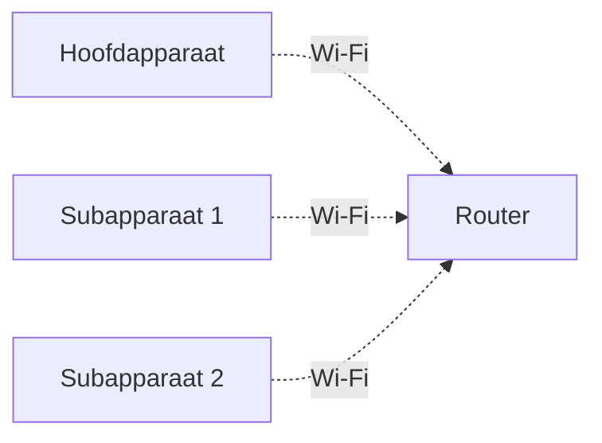
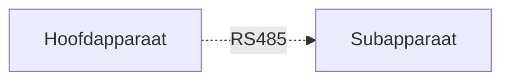
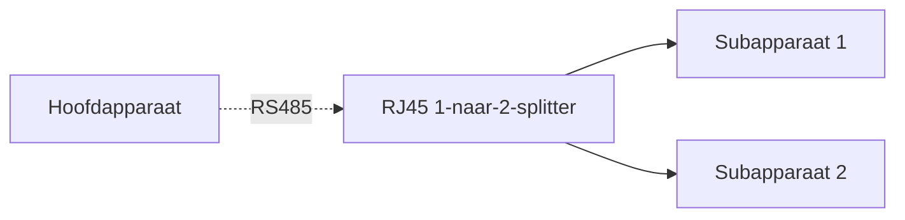

# Cluster

## 1. Wat is een cluster?

Een cluster betekent dat meerdere micro-opslagapparaten worden verbonden tot één geïntegreerd systeem, waarbij de apparaten gezamenlijk zorgen voor stroomvoorziening, energieopslag en energiebeheer.

Binnen een cluster moet één apparaat worden ingesteld als hoofdapparaat, verantwoordelijk voor de systeemregeling en coördinatie. De overige apparaten functioneren als subapparaten. De apparaten communiceren automatisch met elkaar en werken samen als één systeem.

Na het vormen van een cluster nemen zowel het totale uitgangsvermogen als de totale opslagcapaciteit toe. Dit is vooral geschikt voor situaties met hoge belastingen, langdurige noodstroomvoorziening of toekomstige uitbreiding.

---

## 2. Waarom een cluster gebruiken?

De capaciteit en het vermogen van één apparaat zijn beperkt. Wanneer het energieverbruik in huis hoger wordt of langere back-uptijd gewenst is, kan een cluster worden gebruikt om de systeemcapaciteit uit te breiden.

**Hoger uitgangsvermogen**

Meerdere apparaten kunnen tegelijkertijd vermogen leveren om grotere belastingen van stroom te voorzien.

> Bijvoorbeeld:
> - 1 SolidFlex 2000-apparaat: maximaal omvormervermogen van ongeveer 2400 W
> - 2 apparaten in een cluster: maximaal omvormervermogen van ongeveer 4800 W
> - Het daadwerkelijk beschikbare vermogen blijft afhankelijk van netbeperkingen, kabelspecificaties en lokale regelgeving.

**Grotere opslagcapaciteit**

Binnen een cluster werken de batterijen van meerdere apparaten samen, waardoor de beschikbare back-uptijd aanzienlijk wordt verlengd.

> Bijvoorbeeld:
> - 1 SolidFlex 2000 met 5 SFA1800-modules: totale batterijcapaciteit van 10,8 kWh
> - 2 systemen in een cluster: totale capaciteit van ongeveer 21,6 kWh

**Flexibele uitbreiding**

Het systeem ondersteunt stapsgewijze uitbreiding. Gebruikers kunnen beginnen met één apparaat en later extra apparaten toevoegen wanneer nodig, zonder direct het volledige systeem te hoeven installeren.

---

## 3. Ondersteunde apparaten

De volgende modellen kunnen worden gebruikt als hoofd- of subapparaat:

<table><thead>
  <tr>
    <th></th>
    <th colspan="2">Gecentraliseerd cluster</th>
    <th colspan="2">Gecoördineerd cluster</th>
  </tr></thead>
<tbody>
  <tr>
    <td>Model</td>
    <td>Hoofd</td>
    <td>Sub</td>
    <td>Hoofd</td>
    <td>Sub</td>
  </tr>
  <tr>
    <td>BK1600</td>
    <td>❌</td>
    <td>✅</td>
    <td>✅</td>
    <td>✅</td>
  </tr>
  <tr>
    <td>BK1600 Ultra</td>
    <td>✅</td>
    <td>✅</td>
    <td>✅</td>
    <td>✅</td>
  </tr>
  <tr>
    <td>SolidFlex 2000 PowerFlex 2000 SolidFlex 2000 Eco PowerFlex 2000 Eco</td>
    <td>✅</td>
    <td>✅</td>
    <td>✅</td>
    <td>✅</td>
  </tr>
    <tr>
    <td>SolidFlex 1200</td>
    <td>✅</td>
    <td>✅</td>
    <td>✅</td>
    <td>✅</td>
  </tr>
  <tr>
    <td>SolidFlex 3000 AC SolidFlex 3000 AC Pro SolidFlex 3000 Hybrid Pro PowerFlex 3000 AC PowerFlex 3000 Hybrid</td>
    <td>✅</td>
    <td>✅</td>
    <td>✅</td>
    <td>✅</td>
  </tr>
</tbody>
</table>

:::info

- De clusterwerking tussen SolidFlex / PowerFlex-modellen en de BK-serie is niet volledig gevalideerd en wordt daarom niet aanbevolen. SolidFlex- en PowerFlex-modellen kunnen echter met elkaar in een cluster worden gecombineerd.
- Tijdens clustergebruik:
  - Ondersteunt het systeem aansluiting van zonnepanelen via de **PV-interface**
  - Wordt ondersteuning voor micro-omvormers en belastingen via de **Backup-interface** nog verder geoptimaliseerd en is deze momenteel nog niet volledig beschikbaar

:::

---

## 4. Clustermodus

Het systeem ondersteunt maximaal **3 apparaten in één cluster**:

- 1 hoofdapparaat
- Maximaal 2 subapparaten

Afhankelijk van de installatieomgeving kunnen de volgende twee clustermethoden worden gekozen:

### 4.1 Gecoördineerd cluster

Elk apparaat wordt afzonderlijk op het elektriciteitsnet aangesloten en verwerkt zelfstandig de AC-ingang en AC-uitgang. De apparaten synchroniseren gegevens via het communicatienetwerk, terwijl het hoofdapparaat de werking en vermogensverdeling coördineert.

import Tabs from '@theme/Tabs';
import TabItem from '@theme/TabItem';

<Tabs>
  <TabItem value="gen1" label="SolidFlex / PowerFlex" default>
    
  </TabItem>
  <TabItem value="gen2" label="BK1600 / BK1600 Ultra">
    
  </TabItem>
</Tabs>

### 4.2 Gecentraliseerd cluster

De subapparaten worden achter elkaar via voedingskabels met het hoofdapparaat verbonden. Alle AC-ingangen en AC-uitgangen worden uiteindelijk geconcentreerd op het hoofdapparaat, dat de netaansluiting en het volledige energiebeheer verzorgt.

Aansluitmethode:
- Het hoofdapparaat wordt via **GRID IN/OUT** aangesloten op het elektriciteitsnet  
- De **Backup**-interface van het hoofdapparaat wordt verbonden met de **GRID IN/OUT** van het eerste subapparaat  
- Bij meerdere subapparaten worden deze achter elkaar gekoppeld via **Backup → GRID IN/OUT**

<Tabs>
  <TabItem value="gen1" label="SolidFlex / PowerFlex" default>
    
  </TabItem>
  <TabItem value="gen2" label="BK1600 / BK1600 Ultra">
    
  </TabItem>
</Tabs>

---

## 5. Clustercommunicatie

De apparaten moeten met elkaar communiceren om de bedrijfsstatus te synchroniseren. De volgende twee communicatiemethoden worden ondersteund:

### 5.1 Wi-Fi-communicatie

Verbind de apparaten met hetzelfde Wi-Fi-netwerk. Deze methode is geschikt wanneer de apparaten zich dicht bij elkaar bevinden en er een stabiel Wi-Fi-netwerk beschikbaar is.

### 5.2 RS485-communicatie

Verbind het hoofdapparaat en de subapparaten via de RS485-aansluitingen met een netwerkkabel. Deze methode is geschikt voor omgevingen met een zwakke netwerkverbinding of situaties waarin stabiele bekabelde communicatie vereist is.

Als twee subapparaten moeten worden aangesloten, kan een **RJ45 1-naar-2-splitter** worden gebruikt om het hoofdapparaat met de subapparaten te verbinden.

:::info
Als het apparaat momenteel alleen Wi-Fi ondersteunt en een RS485-clusterverbinding vereist is, kan de communicatiemodule worden vervangen door een nieuwere versie. Raadpleeg voor de vervangingsprocedure: [Accessoires vervangen](../advanced/accessory-replacement.md).
:::

## 6. Vermogensbeperkingen van het cluster

Na het instellen van een cluster wordt het maximale systeemvermogen bepaald door:

* Clustermodus
* Apparaatmodel

Hierbij geldt:

* Het **AC-ingangsvermogen** bepaalt het maximale vermogen dat het systeem van het elektriciteitsnet kan opnemen.
* Het **AC-uitgangsvermogen** bepaalt het maximale vermogen dat het systeem aan belastingen kan leveren.

:::danger
Zorg ervoor dat het maximale uitgangsvermogen van het systeem voldoet aan de lokale elektrische normen en veiligheidsvoorschriften.
:::

### 6.1 Vermogen van één apparaat

De maximale AC-ingangs-/uitgangscapaciteit van afzonderlijke apparaten is als volgt:

| Model      | Maximaal AC-uitgangs-/ingangsvermogen |
| ---------- | ------------------------------------- |
| BK-serie   | 1200 W                                |
| 2000-serie | 2400 W                                |
| 1200-serie | 1200 W                                |
| 3000-serie | 3000 W                                |

### 6.2 Maximaal AC-ingangsvermogen

Na het instellen van een cluster kunnen meerdere apparaten tegelijkertijd AC-energie opnemen.

Maximaal AC-ingangsvermogen van het cluster = som van het maximale AC-ingangsvermogen van alle clusterapparaten

### 6.3 Maximaal AC-uitgangsvermogen

Het maximale AC-uitgangsvermogen van een cluster is afhankelijk van de clustermethode.

* **Gecoördineerd cluster:**
  Maximaal AC-uitgangsvermogen van het cluster = som van het maximale AC-uitgangsvermogen van alle clusterapparaten

* **Gecentraliseerd cluster:**
  De AC-ingang en AC-uitgang van alle apparaten worden uiteindelijk via het hoofdapparaat op het elektriciteitsnet aangesloten. Daarom wordt het AC-uitgangsvermogen beperkt door de capaciteit van het hoofdapparaat.

  | Model hoofdapparaat | Maximaal AC-uitgangsvermogen van het cluster |
  | ------------------- | -------------------------------------------- |
  | BK1600 Ultra        | 2300 W                                       |
  | 2000-serie          | 3600 W                                       |
  | 1200-serie          | 2300 W                                       |
  | 3000-serie          | 3600 W                                       |

:::note
Tijdens clusterbedrijf kan het aansluiten van micro-omvormers en belastingen via de bypass-aansluiting leiden tot onnauwkeurige vermogensweergaven. Deze functie wordt momenteel verder geoptimaliseerd.
:::

---

## 7. Vermogensverdeling in het cluster

Tijdens clustergebruik verdeelt het systeem het vermogen automatisch op basis van het batterijniveau en de belasting:

- Het uitgangsvermogen van apparaten kan verschillen
- Niet alle apparaten leveren altijd tegelijkertijd vermogen
- Apparaten met een hogere SOC krijgen prioriteit bij de belasting

Typisch systeemgedrag bij verschillende belastingen:

| Belastingsvermogen | Systeemgedrag |
| ------------------ | ------------- |
| Minder dan 200 W   | Alleen het apparaat met de hoogste SOC levert vermogen |
| 200 W ～ 500 W     | Twee apparaten met hogere SOC delen de belasting |
| Meer dan 500 W     | Alle subapparaten leveren vermogen, verdeeld op basis van SOC |

---

## 8. Een cluster configureren

De clusterconfiguratie kan worden uitgevoerd via de INDEVOLT-app.

Controleer vóór de configuratie het volgende:

- Alle apparaten ondersteunen de clusterfunctie.
- Alle apparaten zijn ingeschakeld.
- Alle apparaten zijn correct met het netwerk verbonden en aan hetzelfde huis toegevoegd.
- Bij een RS485-clusterverbinding zijn de communicatiekabels correct aangesloten.

### Stap 1: Clusterinstellingen openen

Tik op de apparaatdetailpagina rechtsboven op het pictogram  om de instellingen te openen en selecteer vervolgens **Cluster**.

Tik op **Een cluster aanmaken** om een cluster te creëren.

### Stap 2: De clustermodus selecteren

Selecteer de clustermodus: **Gecentraliseerd** of **Gecoördineerd**.

### Stap 3: Hoofd- en subapparaten toevoegen

Houd in de lijst met apparaten die geschikt zijn voor een cluster de apparaatkaart ingedrukt en sleep het apparaat naar het gebied voor het hoofdapparaat of subapparaat.

### Stap 4: De communicatiemethode selecteren

Selecteer de communicatiemethode tussen de geclusterde apparaten: **Wi-Fi** of **RS485**.

Bij selectie van **RS485-communicatie**:
- Het apparaat moet zijn uitgerust met een LAN-module die RS485-communicatie ondersteunt.
- Gebruik een standaardnetwerkkabel om de RS485-aansluitingen van de apparaten met elkaar te verbinden.

### Stap 5: Clusterparameters configureren

Configureer de basisinstellingen van het cluster, waaronder de naam en vermogenslimieten, en tik vervolgens op **Opslaan** om de configuratie te voltooien.

:::danger
Zorg ervoor dat de ingestelde parameters voldoen aan de lokale netvereisten en de geldende wet- en regelgeving.
:::

### Stap 6: Het cluster bekijken en beheren

Na een succesvolle configuratie gaat de app automatisch naar de detailpagina van de clustergroep. Hier kunt u de volledige status van het cluster bekijken, waaronder de relatie tussen het hoofdapparaat en de subapparaten, het realtime vermogen en de energiebeheerstrategieën.

Tik op het instellingenpictogram rechtsboven  om het cluster verder te beheren, bijvoorbeeld door parameters te wijzigen of de clusterverbinding te verbreken.

