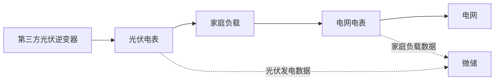

# 第三方逆变器双计量方案

## 1. 为什么需要双计量设备？

当家庭已经安装第三方光伏逆变器时，系统通常通过 **电网电表** 来检测家庭与电网之间的电力流动，并控制储能设备运行：

- 检测到余电上网时，优先为电池充电
- 家庭用电增加时，由电池放电补充
- 尽量减少从电网购电

这种方式可以完成基础控制，但系统只能看到家庭与电网之间的电力交换情况，无法直接知道光伏实际发了多少电。

例如：

```text
光伏发电 3000W
├─ 家庭用电 1000W
└─ 剩余 2000W 上网
```

此时电网电表只能检测到向电网输出 2000W，但无法知道：

- 光伏总共发了多少电
- 家庭实际用了多少光伏电
- 电池充电的电量来自哪里
- 光伏自发自用比例是多少

因此，系统无法完整统计家庭能源数据。

---

## 2. 解决方案

在现有电网电表的基础上，新增一台**光伏电表**，安装完成后：

- 电网电表负责监测家庭与电网之间的电力交换
- 光伏电表负责监测光伏逆变器的发电数据

系统同时获取两路数据后，即可完整计算家庭能源流向。

---

## 3. 支持的光伏电表

<table><thead>
  <tr>
    <th>品牌</th>
    <th>设备</th>
    <th>型号</th>
  </tr></thead>
<tbody>
  <tr>
    <td>INDEVOLT</td>
    <td>电表</td>
    <td>SMD1<br />SMD3</td>
  </tr>
  <tr>
    <td>SOLARMAN</td>
    <td>电表</td>
    <td>MR1-D4-WRE-B<br />MR1-D5-W<br />MR3-D5-WR<br />MR1-D4-WE-B<br />MR1-D5-WR<br />MR3-D4-WE-B<br />MR3-D5-W<br />MR3-D4-WRE-B</td>
  </tr>
  <tr>
    <td>Shelly</td>
    <td>电表</td>
    <td>Pro 3 EM(400)<br />Shelly 3EM<br />Shelly Pro EM<br />Pro 3 EM - 3CT63</td>
  </tr>
</tbody>
</table>


---

## 4. 连接说明

整体连接如下：



### 电网电表

通常安装在家庭并网点或电表箱附近。

主要作用：

- 监测家庭总用电情况
- 判断当前是在购电还是余电上网
- 为储能设备提供充放电控制依据


### 光伏电表

安装在第三方光伏逆变器输出侧。

主要作用：

- 获取光伏实际发电功率
- 上报发电数据至系统
- 提供发电侧基础数据

---

## 5. App 配置步骤

完成安装后，需要分别配置两类计量设备的数据用途。

| 计量设备 | 数据来源 |
| -------- | -------- |
| 电网电表 | 电网     |
| 光伏电表 | 光伏     |

1. 打开 INDEVOLT App，确认两块计量设备都已添加并显示为在线状态。
2. 进入 **我的** > **数据源设置**。
3. 点击 **电网** 或 **光伏**。
4. 选择 **自定义**。
5. 将电网电表设置为 **电网** 数据源。
6. 将光伏电表设置为 **光伏** 数据源。
7. 保存配置。


