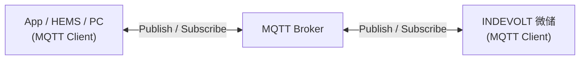

# MQTT 概述

MQTT（Message Queuing Telemetry Transport）是一种基于发布/订阅（Publish/Subscribe）模式的轻量级消息通信协议，广泛应用于物联网设备之间的实时数据交换。

INDEVOLT 微储支持通过 MQTT 与第三方系统进行通信，可用于：

- 实时获取设备运行状态
- 接收设备事件和告警
- 下发设备控制命令
- 集成 Home Assistant、EMS 或其他能源管理平台

MQTT 特别适用于设备数量较多、网络带宽有限或需要实时通信的场景。

---

## 1. 工作原理

MQTT 采用发布/订阅通信模型。所有客户端均通过 MQTT Broker 进行通信，而不会直接互相发送消息。

| 组件            | 角色        | 说明                                       |
| --------------- | ----------- | ------------------------------------------ |
| App / HEMS / PC | MQTT Client | 连接到 Broker，订阅设备数据或发送控制命令  |
| MQTT Broker     | MQTT Broker | 消息服务器，负责接收、过滤并转发 MQTT 消息 |
| INDEVOLT 微储   | MQTT Client | 连接到 Broker，上传设备数据并接收控制命令  |

1. 微储连接 MQTT Broker，根据 Broker 配置，可使用TLS/SSL加密通信
2. 设备主动发布运行数据至 Broker
3. App 或第三方系统订阅对应 Topic
4. MQTT Broker 接收已发布的消息，并将其转发给所有订阅方
5. 用户可向指定 Topic 发布控制命令
6. 设备接收命令并执行对应操作

---

## 2. 适用设备

本功能适用于支持 MQTT 的设备：

| 型号    | 最低适用固件版本   |
| ------- | ------------------ |
| PowerFlex 2000 PowerFlex 2000 Eco SolidFlex 2000 SolidFlex 2000 Eco | CMS: V140C.0B.0036 EMS：V1.01.08 |
| PowerFlex 3000 AC PowerFlex 3000 Hybrid SolidFlex 3000 AC  | CMS: V140C.09.3036  |
| PowerFlex 1200 SolidFlex 1200 | CMS: V140B.09.2036 |

---

## 3. 如何使用

### 3.1 前提条件

开始使用 MQTT 前，请确保：

- ✅ 设备已正常通电
- ✅ 设备已成功联网
- ✅ 设备支持 MQTT 功能

### 3.2 开启 MQTT

设备的 MQTT 功能默认关闭，需在 App 中手动开启，并配置 MQTT Broker 信息。

### 3.3 MQTT 连接参数

| 参数           | 说明                                                   |
| -------------- | ------------------------------------------------------ |
| Broker 地址    | MQTT Broker 地址，可以是本地服务器 IP 或云端服务器地址 |
| 端口           | 1883（非加密） / 8883（TLS/SSL 加密）                  |
| Client ID      | 默认使用设备序列号（SN）                               |
| 用户名         | MQTT 登录账号，默认为空，支持自定义                    |
| 密码           | MQTT 登录密码，默认为空，支持自定义                    |
| TLS            | 是否启用 TLS 加密                                      |
| CA Certificate | TLS 模式下使用的 CA 证书（如需要）                     |
| Keep Alive     | 默认 60 秒                                             |

---

## 4. Topic

Topic 用于标识 MQTT 消息的类别和路由，类似于文件系统中的路径（如：`energy/device1/soc`）。MQTT Broker 根据 Topic 将消息转发给对应的订阅者。

MQTT 支持订阅单个 Topic，也支持使用**通配符**批量订阅。

| 通配符 | 作用         | 示例 |
| ------ | ------------ | ---- |
| `+`    | 匹配单层     |  `energy/+/soc`  可以匹配 `energy/device1/soc`，`energy/device2/soc`； 但不能匹配 `energy/group/device1/soc`，因为多了一层   |
| `#`    | 匹配所有层级 | `energy/#`  表示订阅 `energy` 下所有 Topic，包括：`energy/device1/soc`、`energy/device1/power`、`energy/device2/status`     |

完整 Topic 定义请参考：[MQTT Topic](./mqtt-topic.md)

---

## 5. QoS

QoS（Quality of Service）表示消息传递的可靠性等级。

| QoS   | 说明                                 |
| ----- | ------------------------------------ |
| QoS 0 | 最多发送一次，速度最快，但不保证收到 |
| QoS 1 | 至少发送一次，可能重复               |
| QoS 2 | 仅送达一次，可靠性最高               |

通常建议：
- 实时状态数据：QoS 0 或 1
- 控制命令：QoS 1

---

## 9. FAQ

  
**Q: MQTT 无法连接**

  请检查：
  - Broker 地址是否正确
  - 用户名和密码是否正确
  - 网络是否正常
  - 是否开启 TLS 加密

  
**Q: 为什么订阅后收不到数据？**

  请检查：
  - Topic 是否正确
  - Topic 大小写是否一致
  - 是否订阅了错误层级
  - 设备是否在线

