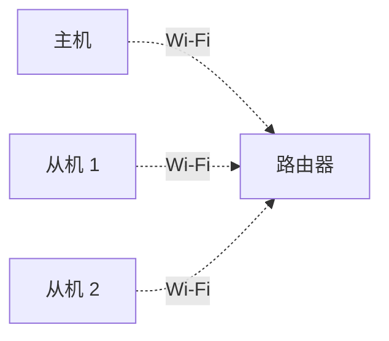
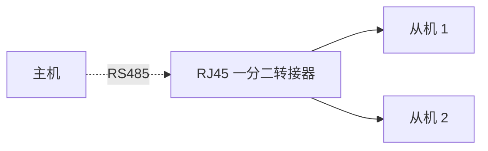

# 并机说明

## 1. 什么是并机

并机是指将多台微储设备连接为一个统一运行的系统，由多台设备共同完成供电、储能与能量管理。

在并机系统中，需要指定 1 台设备作为主机，负责系统控制与运行协调，其余设备作为从机接入系统。设备之间会自动通信并协同工作。

并机后，系统的总输出功率和总储能容量都会提升，更适合高负载、长时间备电或后期扩容场景

---

## 2. 为什么需要并机

单台设备的功率和容量有限。当家庭负载较大，或希望获得更长的供电时间时，可以通过并机扩展系统能力。

**提升输出功率**

多台设备可以同时输出功率，从而带动更大的负载。

> 例如：
> - 1 台 SolidFlex 2000 设备，逆变器最大输出约为 2400W
> - 2 台并机后，逆变器最大输出约为 4800W
> - 实际可输出功率仍会受到电网限制、线路规格以及当地法规限制。

**提升储能容量**

并机后，多台设备的电池共同参与储能，可显著延长供电时间。

> 例如：
> - 1 台 SolidFlex 2000 设备搭配 5 个 SFA1800：电池总量 10.8kWh
> - 两套并机后，总容量约为 21.6kWh

**灵活扩容**

系统支持逐步增加设备。用户可以先安装 1 台设备，后续再根据实际需求增加新的设备，而无需一次性完成全部配置，更适合分阶段建设。

---

## 3. 支持设备

支持以下机型作为主机或从机：

<table><thead>
  <tr>
    <th></th>
    <th colspan="2">集中式并机</th>
    <th colspan="2">协同式并机</th>
  </tr></thead>
<tbody>
  <tr>
    <td>**型号**</td>
    <td>**主机**</td>
    <td>**从机**</td>
    <td>**主机**</td>
    <td>**从机**</td>
  </tr>
  <tr>
    <td>BK1600</td>
    <td>❌</td>
    <td>✅</td>
    <td>✅</td>
    <td>✅</td>
  </tr>
  <tr>
    <td>BK1600 Ultra</td>
    <td>✅</td>
    <td>✅</td>
    <td>✅</td>
    <td>✅</td>
  </tr>
  <tr>
    <td>SolidFlex 2000 PowerFlex 2000 SolidFlex 2000 Eco PowerFlex 2000 Eco</td>
    <td>✅</td>
    <td>✅</td>
    <td>✅</td>
    <td>✅</td>
  </tr>
    <tr>
    <td>SolidFlex 1200</td>
    <td>✅</td>
    <td>✅</td>
    <td>✅</td>
    <td>✅</td>
  </tr>
  <tr>
    <td>SolidFlex 3000 AC SolidFlex 3000 AC Pro SolidFlex 3000 Hybrid Pro PowerFlex 3000 AC PowerFlex 3000 Hybrid</td>
    <td>✅</td>
    <td>✅</td>
    <td>✅</td>
    <td>✅</td>
  </tr>
</tbody>
</table>

:::info

- SolidFlex / PowerFlex 型号 与 BK 系列之间的并机操作未经充分验证，不建议混合并机；但 SolidFlex 与 PowerFlex 系列之间可以任意并机使用。
- 在并机运行状态下：
  - 支持通过 **PV 接口**接入光伏组件
  - 通过 **Backup 接口**连接微逆和负载的功能目前仍在优化中，暂未完全支持

:::

---

## 4. 并机方式

系统最多支持 **3 台设备并机**：
- 1 台主机
- 最多 2 台从机

根据安装环境不同，可选择以下两种并机方式：

### 4.1 协同式并机

每台设备都会独立接入电网，并分别完成交流输入与输出。设备之间通过通信网络进行数据同步，由主机统一协调运行状态与功率分配。

import Tabs from '@theme/Tabs';
import TabItem from '@theme/TabItem';

<Tabs>
  <TabItem value="gen1" label="SolidFlex / PowerFlex" default>
    
  </TabItem>
  <TabItem value="gen2" label="BK1600 / BK1600 Ultra">
    
  </TabItem>
</Tabs>

### 4.2 集中式并机

从设备通过电源线依次连接至主设备，所有设备的交流输入与输出最终都会集中到主设备，由主设备统一接入电网并完成整体输入与输出管理。

连接方式如下：
- 主设备通过 **GRID IN/OUT** 接入电网  
- 主设备的 **Backup** 接口连接第一个从设备的 **GRID IN/OUT**  
- 若存在多个从设备，则依次通过 **Backup → GRID IN/OUT** 级联连接

<Tabs>
  <TabItem value="gen1" label="SolidFlex / PowerFlex" default>
    
  </TabItem>
  <TabItem value="gen2" label="BK1600 / BK1600 Ultra">
    
  </TabItem>
</Tabs>

---

## 5. 并机通信方式

设备之间需要保持通信，以同步运行状态。支持以下两种通信方式：

### 5.1 Wi-Fi 通信

连接设备至同一 Wi-Fi 网络下，适用于设备距离较近，并且现场具有稳定 Wi-Fi 网络的情况。

### 5.2 RS485 通信

通过 RS485 口使用网线连接主从设备，适用于网络环境较弱或需要稳定有线通信的场景。

如需连接两台从机，可通过 **RJ45 一分二转接器**连接主机与从机。

:::info
如果设备当前仅支持 Wi-Fi，需要使用 RS485 并机，可更换为新版本通信模块。具体更换方法请参考：[配件更换](../advanced/accessory-replacement.md)
:::

## 6. 并机系统功率限制

并机后，系统的最大功率取决于：

- 并机方式
- 设备型号

其中：

- **交流输入功率**决定系统可以从电网获取的最大功率
- **交流输出功率**决定系统可以向负载提供的最大功率

:::danger
请确保系统最大输出功率符合当地电气规范及安全法规要求。
:::

### 6.1 单台设备功率

不同型号设备的单机交流输入/输出能力如下：

| 型号      | 最大交流输出/输入功率 |
| --------- | --------------------- |
| BK 系列   | 1200 W                |
| 2000 系列 | 2400 W                |
| 1200 系列 | 1200 W                |
| 3000 系列 | 3000 W                |

### 6.2 最大交流输入功率

并机后，多台设备可以同时进行交流输入。

集群最大交流输入功率 = 所有并机设备最大交流输入功率之和

### 6.3 最大交流输出功率

并机后的最大交流输出功率取决于并机方式。

- 协同式：集群最大交流输出功率 = 所有并机设备最大交流输出功率之和

- 集中式：所有设备的交流输入和输出最终通过主机统一连接电网，因此交流输出能力受到主机功率限制。

  | 主机型号     | 集群最大交流输出功率 |
  | ------------ | -------------------- |
  | BK1600 Ultra | 2300 W               |
  | 2000 系列    | 3600 W               |
  | 1200 系列    | 2300 W               |
  | 3000 系列    | 3600 W               |

:::note
并机状态下，旁路口连接微逆和负载可能存在功率显示不准确的问题，目前仍在持续优化中。
:::

---

## 7. 并机功率分配

并机运行时，系统会根据设备电量与负载情况自动分配功率，因此：
- 不同设备的输出功率可能不同
- 并非所有设备都会同时参与输出
- 电量较高的设备会优先承担负载

在不同负载情况下，系统的典型行为如下：

| 负载功率     | 系统行为                        |
| ------------ | ------------------------------- |
| 低于 200W    | 仅 SOC 最高的单台设备承担       |
| 200W ～ 500W | 两台 SOC 较高的设备分担         |
| 超过 500W    | 所有从设备参与，按 SOC 占比分配 |

---

## 8. 如何设置并机

可通过 INDEVOLT App 完成并机配置。

在开始前，请确认：

- 所有设备均支持并机
- 所有设备均已开机
- 所有设备已正常连接网络，并添加至同一家庭
- RS485 并机时，通信线已正确连接

### 步骤 1：进入并机设置

在设备详情页，点击右上角  图标进入设置页面，选择**并机设置**。

点击**新建并机关系**，开始创建并机集群。

### 步骤 2：选择并机方式

选择并机方式：集中式、协同式。

### 步骤 3：添加主机和从机

在可并机设备列表中，长按设备卡片，拖拽设备至主机或从机区域。

### 步骤 4：选择通信方式

选择并机设备间的通信方式：Wi-Fi、RS485。

如选择 **RS485 通信**：
- 设备需要安装支持 RS485 通信的 LAN 模块。
- 使用标准网线连接设备的 RS485 接口。

### 步骤 5：配置集群参数

设置集群基础配置，包括名称和功率相关限制，点击**保存**完成创建。

:::danger
请确保相关参数符合当地电网要求及法律法规。
:::

### 步骤 6：查看和设置集群

并机成功后，App 会自动进入并机分组详情页，在这里可以查看整个集群的运行状态，包括主机与从机关系、实时功率以及用能策略。

点击页面右上角  进入设置后，可以对集群进行进一步管理，例如修改参数或解除并机关系。

